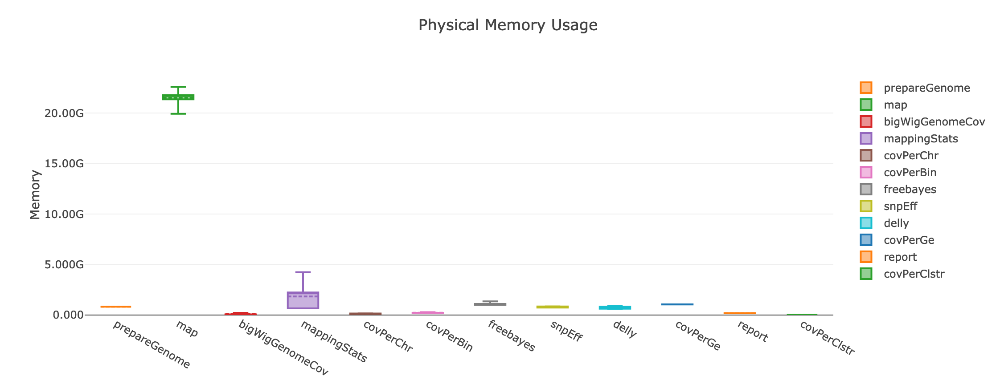
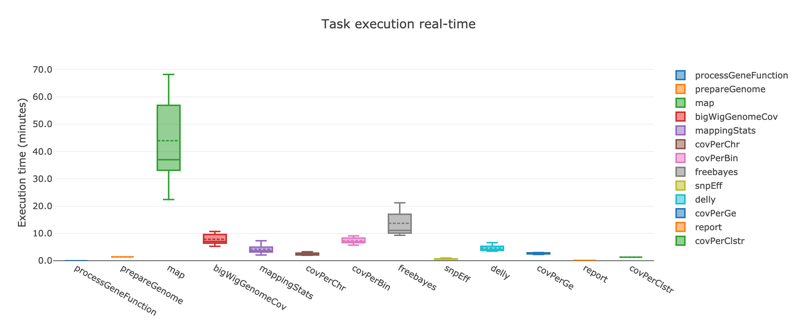

##############
Worked example
##############

Installing Dependencies
-----------------------
GIP dependencies are Nextflow and Singularity.
Instructions to install these software can be found on the respective websites:

| `Nextflow <https://www.nextflow.io/docs/latest/getstarted.html>`_
| `Singularity <https://sylabs.io/guides/3.8/user-guide/quick_start.html#install>`_

To install Nextflow on a local folder:

.. code-block:: bash

 wget -qO- https://get.nextflow.io | bash
 chmod +x nextflow

To install Singularity You must first install development libraries to your host. Assuming Ubuntu:

.. code-block:: bash

 sudo apt-get update && sudo apt-get install -y \
    build-essential \
    libssl-dev \
    uuid-dev \
    libgpgme11-dev \
    squashfs-tools \
    libseccomp-dev \
    wget \
    pkg-config \
    git \
    cryptsetup

Then there are 3 more steps to install Singularity:

1) Installing Go (following instructions at https://golang.org/doc/install)

.. code-block:: bash

 wget https://golang.org/dl/go1.17.1.linux-amd64.tar.gz
 sudo rm -rf /usr/local/go
 sudo tar -C /usr/local -xzf go1.17.1.linux-amd64.tar.gz
 #add to your .bashrc the following lines:
 export GOPATH=${HOME}/go
 export PATH=/usr/local/go/bin:${PATH}:${GOPATH}/bin

2) Downloading Singularity

.. code-block:: bash

 export VERSION=3.8.1 && # adjust this as necessary \
    wget https://github.com/sylabs/singularity/releases/download/v${VERSION}/singularity-ce-${VERSION}.tar.gz && \
    tar -xzf singularity-ce-${VERSION}.tar.gz && \
    cd singularity-ce-${VERSION}

3) Compiling Singularity Source Code

.. code-block:: bash

 ./mconfig && \
    make -C builddir && \
    sudo make -C builddir install
 cd ..

Installing GIP
--------------

The following code will create a copy of GIP and giptools in the local folder.

.. code-block:: bash

 #download GIP
 git clone https://github.com/giovannibussotti/GIP.git
 #download giptools
 singularity pull giptools library://giovannibussotti/default/giptools

Data acquisition
----------------

GIP user may have access to private WGS data sets, or use publicly avaiablable data. In this tutorial we will consider 7 *Leishmania infantum* WGS samples available from the SRA database under the `PRJNA607007 <https://www.ncbi.nlm.nih.gov/sra/?term=PRJNA607007>`_ accession.
An easy way to retrieve the accessions of the individual samples click on "Send to", then "File", then select "Accession list" format.
The resulting file will contain the following accessions:

| SRR11098642
| SRR11098643
| SRR11098644
| SRR11098645
| SRR11098646
| SRR11098647
| SRR11098648

To download these datasets the user can use the `SRA Toolkit <https://trace.ncbi.nlm.nih.gov/Traces/sra/sra.cgi?view=toolkit_doc>`_. Installation instructions are available from `this page <https://github.com/ncbi/sra-tools/wiki/02.-Installing-SRA-Toolkit>`_, and involve:

.. code-block:: bash

 #downloading sratoolkit
 wget http://ftp-trace.ncbi.nlm.nih.gov/sra/sdk/current/sratoolkit.current-ubuntu64.tar.gz
 tar -xzf sratoolkit.current-ubuntu64.tar.gz
 #configure enabling remote access, local file caching and remote cloud instance identity using
 ./sratoolkit.2.11.1-ubuntu64/bin/vdb-config --interactive

The following code snippet can be copy/pasted in a bash terminal to recursively download each of the 7 WGS experiment with SRA Toolkit:

.. code-block:: bash

 accessions=(SRR11098642 SRR11098643 SRR11098644 SRR11098645 SRR11098646 SRR11098647 SRR11098648)
 mkdir fastqs
 cd fastqs
 for X in "${accessions[@]}" ; do
   #download from accession
   ../sratoolkit.2.11.1-ubuntu64/bin/prefetch $X
   #convert to fastq
   ../sratoolkit.2.11.1-ubuntu64/bin/fastq-dump --split-files $X
   #compress
   gzip ${X}*fastq
   #remove .sra file
   rm -rf $X
 done
 cd ..
 

Depending on your species of interest the user may need to refer to different specialized genomic data banks to retrieve the genome sequence and the gene coordinates, which are both required GIP inputs (respectively \-\-genome and \-\-annotation).
Additionally, the user may want to specify gene function annotations (\-\-geneFunction parameter). Depending on the species, gene function annotation may be not completely available, and manual curation or data integration from different repositories may be needed.
In the code snipped below we use the ENSEMBL protists FTP server to download the latest *Leishmaina infantum* genome sequence and annotations in .gff3 format, then reformat the latter to obtain both the gene coordinates file (.gtf format) and the gene function files.

.. code-block:: bash

 mkdir data
 cd data
 #download genome
 wget ftp://ftp.ensemblgenomes.org/pub/release-48/protists/fasta/protists_euglenozoa1_collection/leishmania_infantum_gca_900500625/dna/Leishmania_infantum_gca_900500625.LINF.dna.toplevel.fa.gz  
 #donwload gene annotations
 wget ftp://ftp.ensemblgenomes.org/pub/release-48/protists/gff3/protists_euglenozoa1_collection/leishmania_infantum_gca_900500625/Leishmania_infantum_gca_900500625.LINF.48.gff3.gz
 #convert
 gff3=Leishmania_infantum_gca_900500625.LINF.48.gff3.gz
 perl -e '
 open (F,">geneFunction.tsv") or die "cannot open geneFunction.tsv: $!";
 open (G,">annotation.gtf") or die "cannot open annotation.gtf: $!";
 open(IN, "gunzip -c '$gff3' |") or die "gunzip '$gff3': $!";
 while(<IN>){
  if($_=~/^(.*)ID=gene:([^;]+).*description=([^;]+)/){
   my $a   = $1;
   my $id  = $2;
   my $des = $3;
   print G "${a}gene_id \"$id\"; transcript_id \"$id\";\n";
   print F "$id\t$des\n";

  }
 }
 close F;
 close G;' 
 cd ..

All the required data is now available. 
 

GIP configuration
-----------------

The user should prepare the index file indicating the sample names and the respective sequencing data files.
The index is a tab separated file with the following heading row: sampleId	read1	read2
In this example we will use the sample names as reported in `PRJNA607007 <https://www.ncbi.nlm.nih.gov/bioproject/PRJNA607007>`_ and the data file paths as they are in the host system.

In this particular case, sample names retrieval can be automated using `NCBI E-utils <https://www.ncbi.nlm.nih.gov/books/NBK179288>`_):

.. code-block:: bash

  accessions=(SRR11098642 SRR11098643 SRR11098644 SRR11098645 SRR11098646 SRR11098647 SRR11098648)
  cd fastqs
  for X in "${accessions[@]}" ; do
    esearch -db sra -query "$X" | efetch -format runinfo | cut -f1,12 -d,
  done | grep -v "^Run" | awk -F',' 'BEGIN {OFS="\t"; print "sampleId\tread1\tread2"} {print $2,ENVIRON["PWD"]"/"$1"_1.fastq.gz",ENVIRON["PWD"]"/"$1"_2.fastq.gz"}'> sample_ids.tsv
  cd ..

So if the fastq files are stored in the ``/pasteur/tutorial/fastqs``, the index file should look like :download:`this <../_static/sampleIndexExample.pdf>`.

Next, the user must edit the GIP configuration file (i.e. **gip.config**) according to the available computing resources, and most importantly, binding an up-level directory containing all the data paths. In this example the ``/pasteur`` would be a good choice. 
Assuming that the user copied giptools locally as ``/pasteur/tutorial/giptools``, and that he/she wants to execute GIP on a slurm cluster with special partition and quality of service options ``-p aTeam --qos fast`` while keeping the default for all the rest, the parameters that need to be updated are:

* ``executor='slurm'``
* ``clusterOptions='-p aTeam --qos fast'``
* ``container='/pasteur/tutorial/giptools'`` 
* ``runOptions = '--bind /pasteur'``

The edited configuration file using default parametrization should look like :download:`this <../_static/gip.config.workedExample.pdf>`.
In this example all processes will run with 1 CPU and max 40 Gb of memory.
It is possible to adjust the cpu and memory parameter for individual processes using the ``withName`` Nextflow option specifying the process name and the desired resources. For instance adding ``withName: map { cpus=4 }`` in the process section will execute the map process with 4 cpus.
The complete list of GIP processes includes:

| processGeneFunction
| prepareGenome
| map
| mappingStats
| covPerChr
| covPerBin
| covPerGe
| freebayes
| snpEff
| delly
| bigWigGenomeCov
| covPerClstr
| report

The processes that can  benefit from multi CPU parallelization are: prepareGenome, map and bigWigGenomeCov.
The map process that has by far the highest memory requirements and execution time:

If instead the user cannot take advantage of a computing cluster, then he/she can run GIP locally by simply specifying ``executor='local'``.

GIP execution
-------------

To run GIP:

.. code-block:: bash

 ./nextflow GIP/gip --genome /pasteur/tutorial/data/Leishmania_infantum_gca_900500625.LINF.dna.toplevel.fa.gz \
              --annotation /pasteur/tutorial/data/annotation.gtf \
              --geneFunctions /pasteur/tutorial/data/geneFunction.tsv \
              --index index.tsv \
              -c gip.config

If executed on a computing cluster, `it is recommended not to run nextflow on the submission node directly <https://www.nextflow.io/blog/2021/5_tips_for_hpc_users.html>`_).
For instance, if the executor is slurm, the above command-line should be executed via sbatch.

Assuming that the user now wants to test a stricter parametrization for the SNV filtering he/she can edit the filterFreebayesOPT parameter and increase the \-\-minFreq value to 0.3. Then, when re-execute GIP, it is possible to add the ``-resume`` option to the command line to compute just the processes affected by the parameter change. GIP will re-use the cached results of all the other processes.

