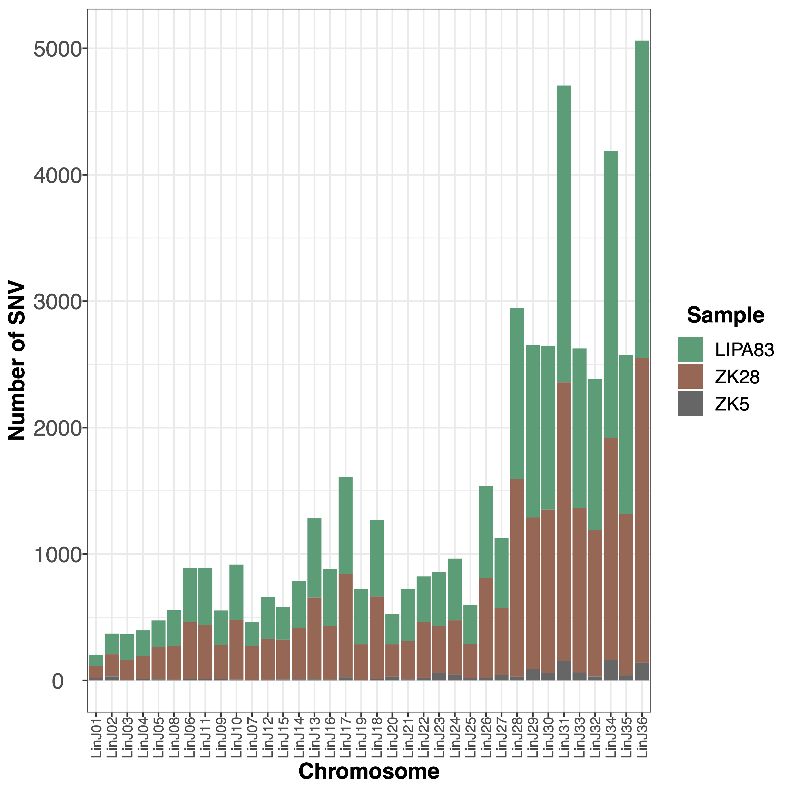
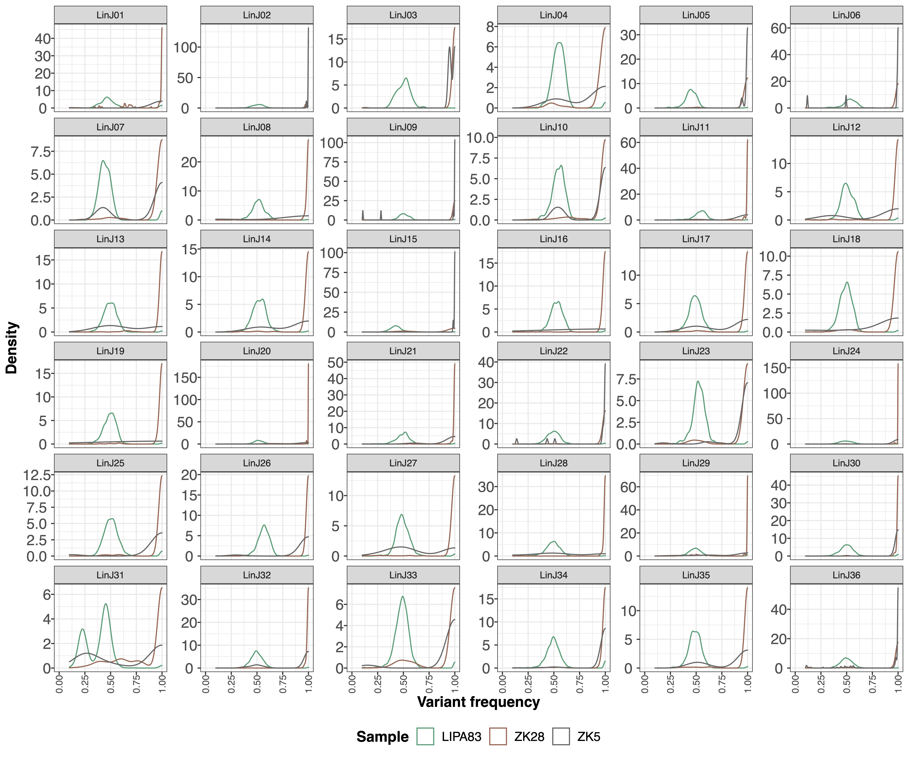
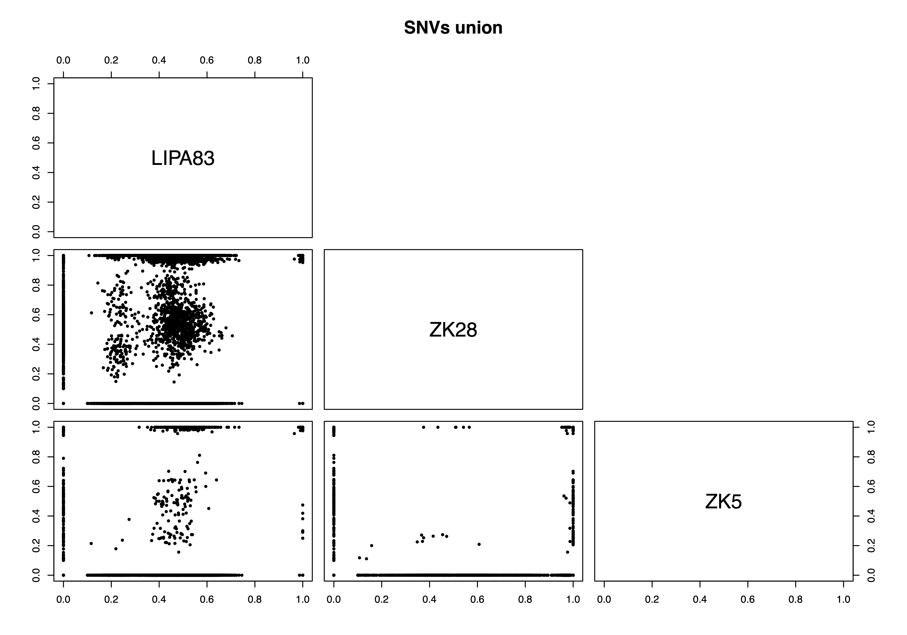
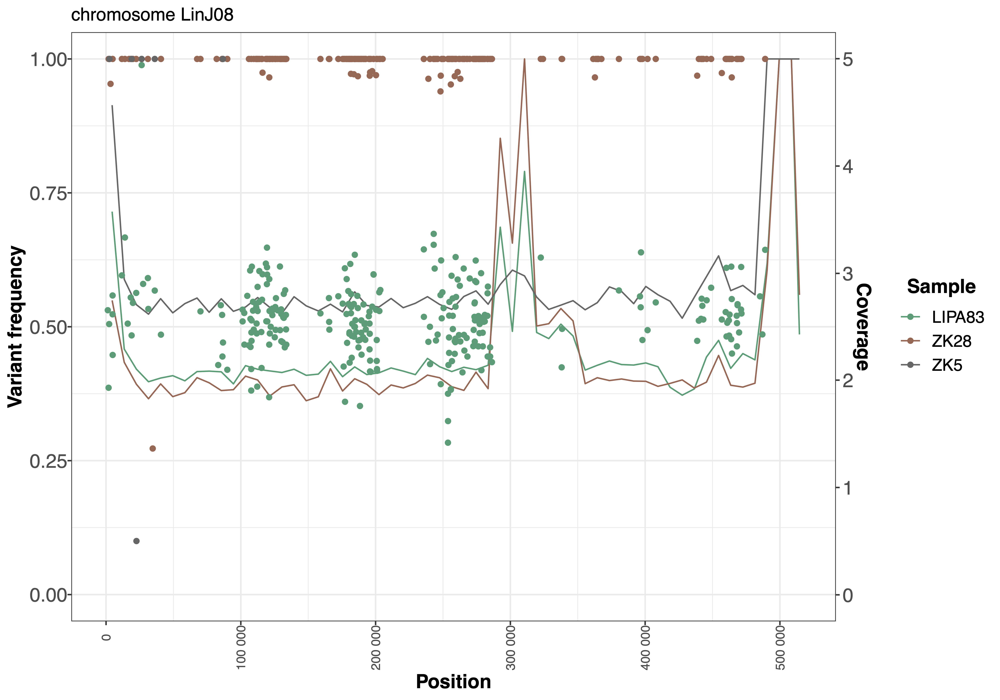
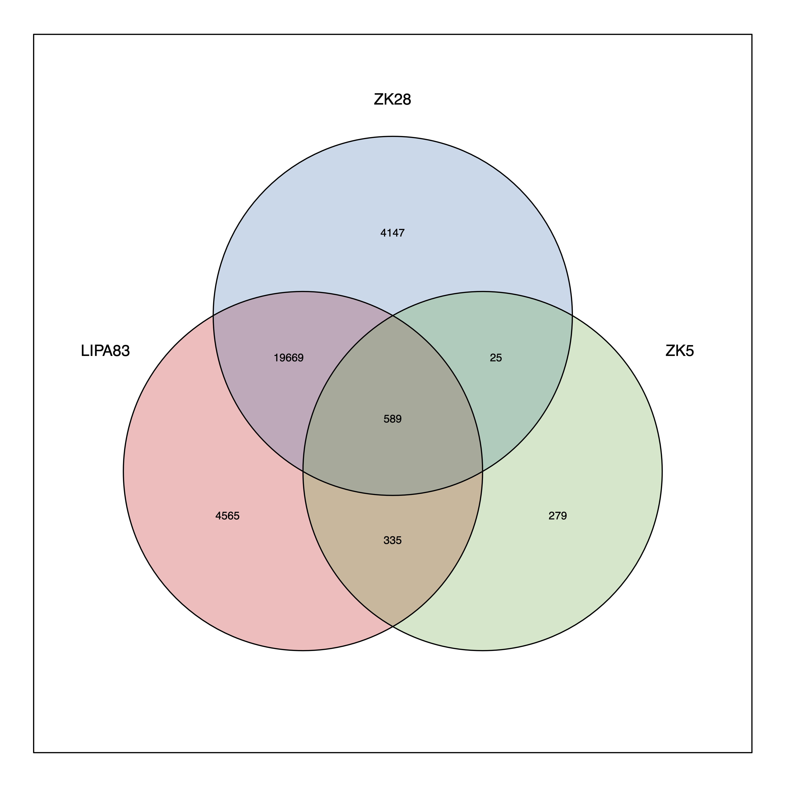

###
SNV
###

Options
-------

+-----------------------+--------------------------------------------------------------+----------------+
|Option                 |Description                                                   |Argument        |
+=======================+==============================================================+================+
|\-\-samples            |Sample names. It determines the plotting order.               |[char ...]      |
|                       |                                                              |                |
|                       |If "NA" all samples are used [default NA]                     |                |
+-----------------------+--------------------------------------------------------------+----------------+
|\-\-gipOut             |GIP output directory [default gipOut]                         |[char]          |
+-----------------------+--------------------------------------------------------------+----------------+
|\-\-outName            |Output name [default gipOut/sampleComparison/SNV]             |[char]          |
+-----------------------+--------------------------------------------------------------+----------------+
|\-\-chrs               |Chromosomes to use. If "NA" it uses the same chromsomes as GIP|[char ...]      |
|                       |                                                              |                |
|                       |[default NA]                                                  |                |
+-----------------------+--------------------------------------------------------------+----------------+
|\-\-coordCartesianYlim |Max y-axis value for density plots                            |[double]        |
|                       |                                                              |                |
|                       |If \"NA\" the value is automatically attributed [default NA]  |                |
+-----------------------+--------------------------------------------------------------+----------------+
|\-\-minVRF             |Discard SNVs with frequency < --minVRF [default 0]            |[double]        |
+-----------------------+--------------------------------------------------------------+----------------+
|\-\-maxVRF             |Discard SNVs with frequency > --maxVRF [default 1]            |[double]        |
+-----------------------+--------------------------------------------------------------+----------------+
|\-\-denLineSize        |Density plot line thickness [default 1]                       |[double]        |
+-----------------------+--------------------------------------------------------------+----------------+
|\-\-SNVopacity         |Opacity value of the dots representing SNVs.                  |[double]        |
|                       |                                                              |                |
|                       |Max 1, Min 0 [default 1]                                      |                |
+-----------------------+--------------------------------------------------------------+----------------+
|\-\-showCoverage       |Overlay sequencing coverage                                   |                |
+-----------------------+--------------------------------------------------------------+----------------+
|\-\-covLineSize        |Coverage line thickness.                                      |[double]        |
|                       |                                                              |                |
|                       |DEPENDENCY --showCoverage [default 0.5]                       |                |
+-----------------------+--------------------------------------------------------------+----------------+
|\-\-smoothingFactor    |Merge and average the normalized coverage of this number      |[double]        |
|                       |                                                              |                |
|                       |of adjacent bins. DEPENDENCY --showCoverage [default 30]      |                |
+-----------------------+--------------------------------------------------------------+----------------+
|\-\-maxCov             |Normalized coverage values > \-\-maxCov are shown             |[double]        |
|                       |                                                              |                |
|                       |as \-\-maxCov. DEPENDENCY --showCoverage [default 5]          |                |
+-----------------------+--------------------------------------------------------------+----------------+
|\-\-customColors       |TSV file with 2 columns named "SAMPLE" and "COLOR"            |[char]          |
|                       |                                                              |                |
|                       |indicating the color to be used for each sample               |                |
|                       |                                                              |                |
|                       |If "NA" colors are automatically assigned [default NA]        |                |
+-----------------------+--------------------------------------------------------------+----------------+
|\-\-randomSNVtoShow    |Number of random SNV to show in scatterplots.                 |[integer]       |
|                       |                                                              |                |
|                       |If "NA" all SNVs are shown [default NA]                       |                |
+-----------------------+--------------------------------------------------------------+----------------+
|\-\-debug              |Dump session and quit                                         |                |
+-----------------------+--------------------------------------------------------------+----------------+
|\-h, \-\-help          |Show help message                                             |                |
+-----------------------+--------------------------------------------------------------+----------------+

Description
-----------
| The ``SNV`` module aims at comparing the SNV in terms of number, position and frequency for a samples set.
| For each sample the module loads the GIP files with the filtered SNVs data (singleVariants.df.gz files) and generates multiple plots overlaying in different colors the SNVs sets. 
| Should a sample set present a huge number of SNVs (e.g. cancer samples) the user can specify the ``--randomSNVtoShow`` graphical options to set the maximum number of SNVs to be shown in scatterplots and reduce overplotting. This option does not affects the density profiles, which are in any case estimated using all selected SNVs, i.e. they are never based on a random SNV subset.
 

Example
-------
| From the GIP worked example folder execute

| ``giptools SNV``

| This will generate the SNV output files in the **gipOut/sampleComparison** folder.
| By default this module will consider all the GIP samples. Depending on the number of SNVs and the number of processed samples the resulting figures may be too dense and difficoult to read. The user can specify a sample subset with the ``--samples`` option. 
| In addition, this module offers the possibility to overlay the genomic bin sequencing coverage to the SNV frequency by specifying the ``--showCoverage`` option.
| The ``giptools SNV --samples LIPA83 ZK28 ZK5 --showCoverage`` command produces the **SNV.count.pdf** reporting a stacked barplot with the number of SNVs for each chromosome and for each sample:

The **SNV.overview.pdf** and **SNV.multipanel.pdf** files offer an overview of all detected SNVs across the different chromosomes:

.. figure:: ../_static/SNV.overview.png
      :width: 100 %

.. figure:: ../_static/SNV.multipanel.png
      :width: 100 %

The **SNV.density.pdf** file provides a representation of the density distributions of the SNV frequencies in the different chromosomes:

The **SNV.pairwise.pdf** files includes two plots demonstrating the frequency of detected SNVs in pairwise sample comparisons. The first plot represents the union of all SNVs detected across all samples processed with the ``giptools SNV`` module. The second plot show the intersection set, which includes just the SNVs detected (i.e. variant allele frequency > 0) in all the considered samples. The union plot fir this example is the following:

The **SNV.byChr.pdf** file includes one separate plot for each chromosome, showing the position and the variant allele frequency of detected SNVs. If the option ``--showCoverage`` is selected, these plots will include one line per sample showing the bin sequencing coverage. The plot produced for chromosome 8 in this example is the following:

If the module analyzes less than 8 samples, then it will also generate the **SNV.venn.pdf** plot showing a Venn diagram demonstrating the number of unique and shared SNVs in the sample set:

The **SNV.xlsx** reports the list of SNVs with the variant allele frequency measured in each sample, and the predicted SNV effect.

 

