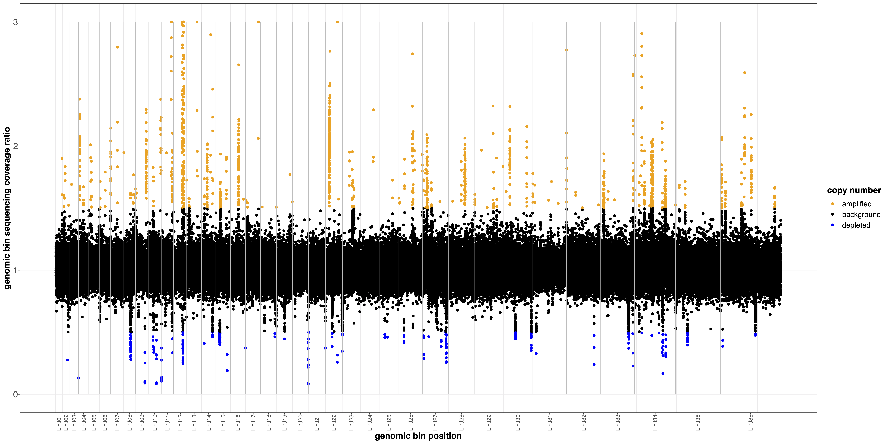
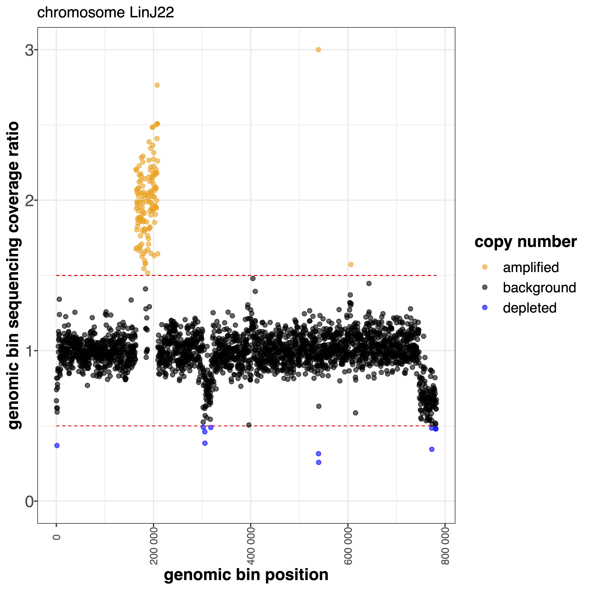

######
binCNV
######

Options
-------

+-------------------+------------------------------------------------------------------+----------------+
|Option             |Description                                                       |Argument        |
+===================+==================================================================+================+
|\-\-samples        |Sample names. It determines the plotting order [**required**]     |[char ...]      |
+-------------------+------------------------------------------------------------------+----------------+ 
|\-\-gipOut         |GIP output directory [default gipOut]                             |[char]          |
+-------------------+------------------------------------------------------------------+----------------+
|\-\-outName        |Output name [default gipOut/sampleComparison/binCNV]              |[char]          |
+-------------------+------------------------------------------------------------------+----------------+
|\-\-chrs           |Chromosomes to use. If "NA" it uses the same chromsomes as GIP    |[char ...]      |
|                   |                                                                  |                |
|                   |[default NA]                                                      |                |
+-------------------+------------------------------------------------------------------+----------------+
|\-\-MAPQ           |Label bins with MAPQ < --MAPQ [default 0]                         |[int]           |
+-------------------+------------------------------------------------------------------+----------------+  
|\-\-ylim           |Plot visualization threshold. Bin ratio values greather than this |[double]        |
|                   |                                                                  |                |   
|                   |threshold are shown as --ylim [default 3]                         |                |
+-------------------+------------------------------------------------------------------+----------------+
|\-\-highLowRatio   | Provide 2 numbers. Bins with ratio scores > num1                 |[double,double] |
|                   |                                                                  |                |
|                   | or < num2 will be colored differently [default 1.5  0.5]         |                |
+-------------------+------------------------------------------------------------------+----------------+
|\-\-pseudocount    | Normalized mean coverage pseudo count value preventing           |[double]        |
|                   |                                                                  |                |
|                   |  infinite (1/0) and NaN (0/0) ratio values [default 0.1]         |                |
+-------------------+------------------------------------------------------------------+----------------+  
|\-\-debug          |Dump session and quit                                             |                |
+-------------------+------------------------------------------------------------------+----------------+
|\-h, \-\-help      |Show help message                                                 |                |
+-------------------+------------------------------------------------------------------+----------------+

Description
-----------
| The ``binCNV`` module aims at comparing the bin sequencing coverage of 2 samples. This module is useful to identify intra-chromosomal CNV regions between 2 isolates.
| For each sample the module loads the GIP files with the bin sequencing coverage (.covPerBin.gz files) and calculates the ratio of the normalized coverage value between corresponding bins. 

Example
-------
| From the GIP worked example folder execute

| ``giptools binCNV --samples ZK43 LIPA83``

| This will generate the binCNV output files in the **gipOut/sampleComparison** folder.
| The output consists in four files. 

| The **binCNV.overview.pdf** file shows the bin coverage ratio of all chromosomes in a row

| The **binCNV.multiPanel.pdf** file shows the bin coverage ratio of all chromosomes in multiple panels

.. figure:: ../_static/binCNV.multiPanel.png
      :width: 100 %

| The binCNV.byChr.pdf file contains multiple plots, on for each chromsome separatelly. As an example, the plot produced for chromosome 22 is the following:

| The binCNV.xlsx file reports for each genomic bin the genomic coordinates, the computed ratio value and the color used for its representation.

