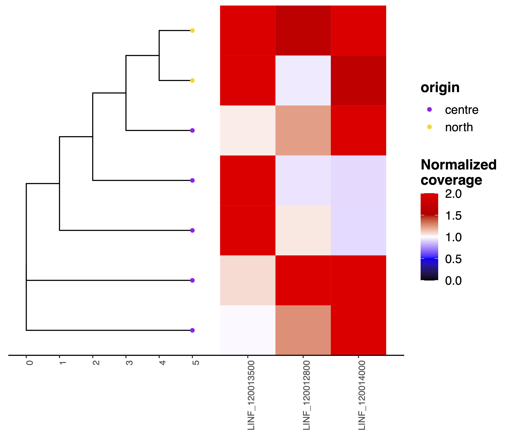

#############
convergentCNV
#############

Options
-------

+-------------------+------------------------------------------------------------------+----------------+
|Option             |Description                                                       |Argument        |
+===================+==================================================================+================+
|\-\-gipOut         |GIP output directory  [default gipOut]                            |[char]          |
+-------------------+------------------------------------------------------------------+----------------+
|\-\-outName        |Output name [default gipOut/sampleComparison/convergentCNV]       |[char]          |
+-------------------+------------------------------------------------------------------+----------------+
|\-\-newickTree     |Newick tree file produced with the phylogeny module               |[char]          |
|                   |                                                                  |                |
|                   |[default gipOut/sampleComparison/phylogeny.treefile]              |                |
+-------------------+------------------------------------------------------------------+----------------+
|\-\-geCNV          |Gene CNV excel file produced with the geInteraction module        |[char]          |
|                   |                                                                  |                |
|                   |[default gipOut/sampleComparison/geInteraction.CNV.xlsx]          |                |
+-------------------+------------------------------------------------------------------+----------------+
|\-\-ampThresh      |Gene normalized coverage amplification threshold [default 1.5]    |[double]        |
+-------------------+------------------------------------------------------------------+----------------+
|\-\-notAmpThresh   |Gene normalized coverage threshold below which the gene is        |[double]        |
|                   |                                                                  |                |
|                   |considered as not amplified [default 1]                           |                |
+-------------------+------------------------------------------------------------------+----------------+
|\-\-covSaturation  |Gene normalized coverage saturation value [default 2]             |[double]        |
+-------------------+------------------------------------------------------------------+----------------+
|\-\-treeTip        |Color tree tip by this feature.                                   |[char]          |
|                   |                                                                  |                |
|                   |If \"NA\" tree tips are not colored [default NA]                  |                |
+-------------------+------------------------------------------------------------------+----------------+
|\-\-tipLab         |Show sample names on the tree tips                                |                |
+-------------------+------------------------------------------------------------------+----------------+
|\-\-hexpand        |Avoid truncating tip labels expanding the plot panel              |[double]        |
|                   |                                                                  |                |
|                   |by a ratio of the x axis range [default 0]                        |                |
+-------------------+------------------------------------------------------------------+----------------+
|\-\-branchLen      |Branch length ggtree parameter [default none]                     |[branch.length  |
|                   |                                                                  |                |
|                   |                                                                  | | none]        |
+-------------------+------------------------------------------------------------------+----------------+
|\-\-layout         |Layout ggtree parameter [default rectangular]                     |[rectangular|   |
|                   |                                                                  |                |
|                   |                                                                  |slanted |       |
|                   |                                                                  |                |
|                   |                                                                  |circular|       |      
|                   |                                                                  |                |
|                   |                                                                  |fan |           |
|                   |                                                                  |                |
|                   |                                                                  |daylight]       |
+-------------------+------------------------------------------------------------------+----------------+
|\-\-hideHeatmap    |Do not display the heatmap                                        |                |
+-------------------+------------------------------------------------------------------+----------------+
|\-\-heatCols       |Heatmap gradient colors [default black blue white red3 red]       |[char ...]      |
+-------------------+------------------------------------------------------------------+----------------+
|\-\-heatMin        |Heatmap minimum normalized coverage value [default 0]             |[double]        |
+-------------------+------------------------------------------------------------------+----------------+
|\-\-hideXlabs      |Do not display x-axis text                                        |                |
+-------------------+------------------------------------------------------------------+----------------+
|\-\-plotDim        |File height and width values [default 6 7]                        |[double ...]    |
+-------------------+------------------------------------------------------------------+----------------+
|\-\-debug          |Dump session and quit                                             |                |
+-------------------+------------------------------------------------------------------+----------------+

Description
-----------

The ``convergentCNV`` module is meant to detect convergent CNV gene amplifications. Before running this module the user must first execute the ``geInteraction`` and the ``phylogeny`` modules to predict the CNV genes and samples phylogeny. For each gene CNV the ``convergentCNV`` module identifies the sample pairs (e.g. D and Z) for which the gene is amplified above the normalized coverage threshold (i.e. ``--ampThresh``) and the phylogenetic distance in maximal. Then it evaluates whether there is at least a third sample (e.g. G) not showing the amplification (i.e. normalized coverage < ``--notAmpThresh``) and whose phylogenetic relation is in between the two samples supporting the gene amplification (D and Z). The presence of this intervening sample makes sure that the observed amplification is not explained by a common ancestor. All the geneCNVs fulfilling these sequencing coverage and phylogenetic distance search criteria are selected and used for visualization. 
Caveat. This module looks for the not-amplified gene just in the samples positioned between the two most distantly related samples showing the amplification (D and Z). Despite unlikely, a given gene CNV could show convergent amplification between samples more closely related and not included in the D to Z range (e.g. A and D) and be left undetected.      

Example
-------
| From the GIP worked example folder execute

| ``giptools convergentCNV``

| This will generate the convergentCNV output files in the **gipOut/sampleComparison** folder.
| The **convergentCNV.pdf** file show the predicted phylogenetic tree side by side with an heatmap showing the normalized gene coverage of the gene CNVS presenting convergent amplifications.
| The user can use the ``--treeTip`` parameter to color the tree tips according to a feature provided with the ``--samplesList`` option of the ``geInteraction`` module. For instace running the ``giptools convergentCNV --treeTip origin`` command will result in the following plot:

| Caveat. The time scale on the tree x axis should not be considered when the ``--branchLen`` parameter is equal to none (i.e. a cladogram).  

