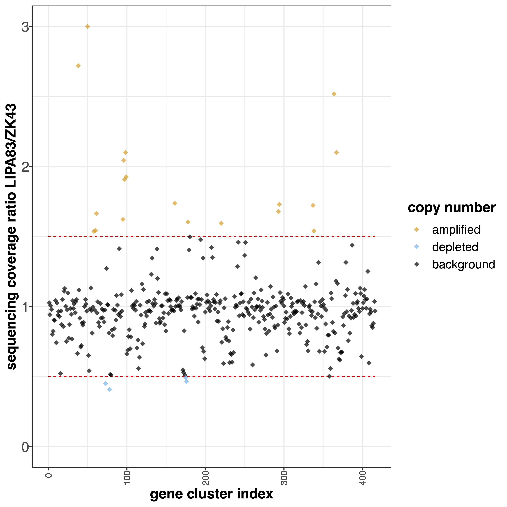
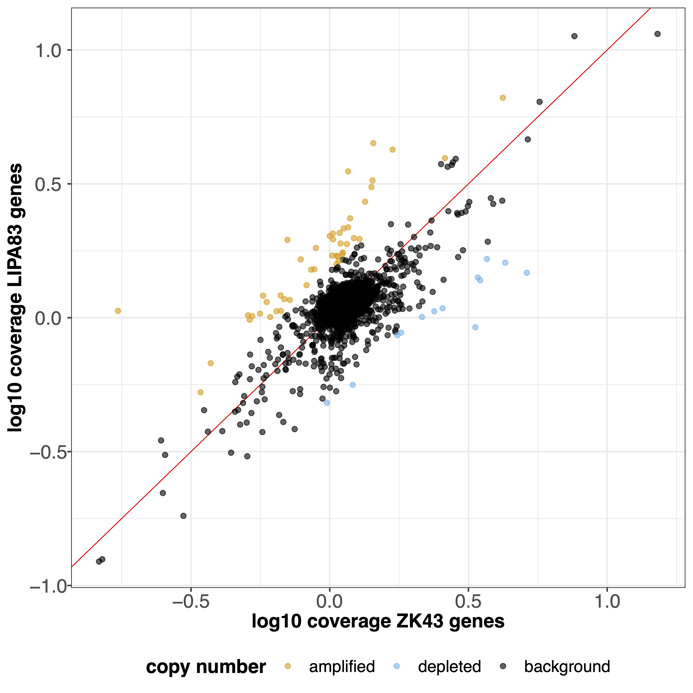
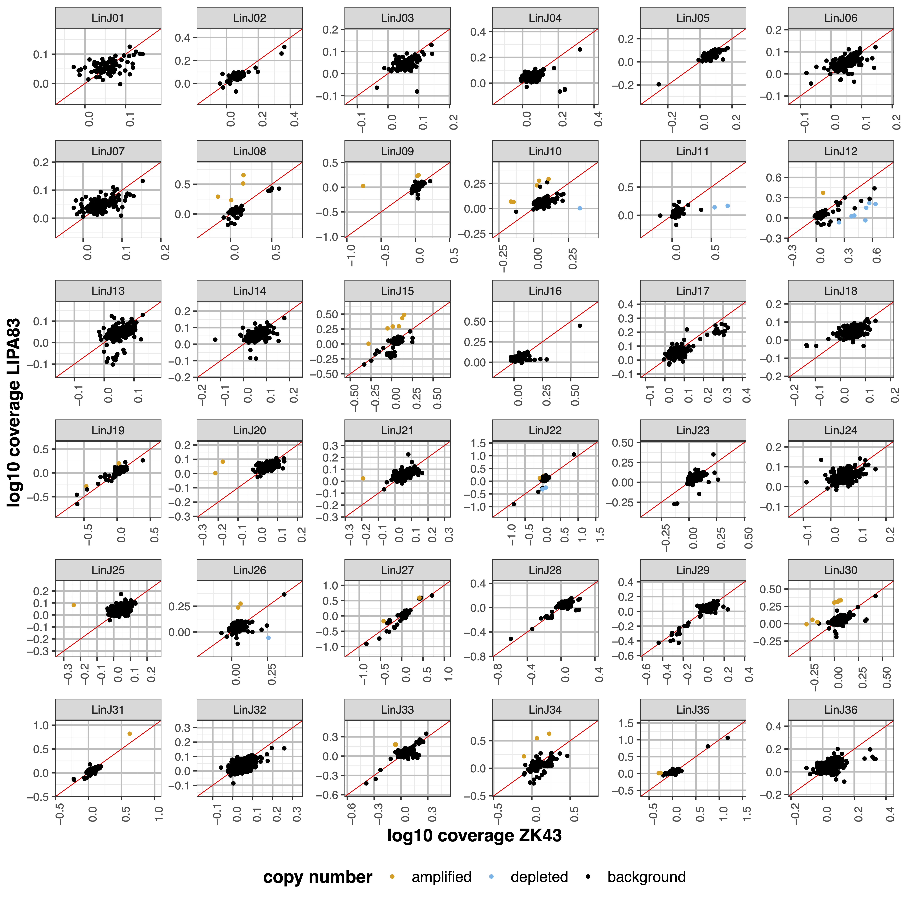

#####
geCNV
##### 

Options
-------

+-------------------+------------------------------------------------------------------+----------------+
|Option             |Description                                                       |Argument        |
+===================+==================================================================+================+
|\-\-samples        |Sample names. It determines the plotting order [**required**]     |[char ...]      |
+-------------------+------------------------------------------------------------------+----------------+
|\-\-gipOut         |GIP output directory [default gipOut]                             |[char]          |
+-------------------+------------------------------------------------------------------+----------------+
|\-\-outName        |Output name [default gipOut/sampleComparison/geCNV]               |[char]          |
+-------------------+------------------------------------------------------------------+----------------+
|\-\-chrs           |Chromosomes to use. If "NA" it uses the same chromsomes as GIP    |[char ...]      |
|                   |                                                                  |                |
|                   |[default NA]                                                      |                |
+-------------------+------------------------------------------------------------------+----------------+
|\-\-MAPQ           |Label genes with MAPQ < --MAPQ [default 0]                        |[int]           |
+-------------------+------------------------------------------------------------------+----------------+
|\-\-highLowRatio   |Provide 2 numbers. Genes with ratio scores > num1                 |[double,double] |
|                   |                                                                  |                |
|                   |or < num2 will be colored differently [default 1.5  0.5]          |                |
+-------------------+------------------------------------------------------------------+----------------+
|\-\-pseudocount    |Normalized mean coverage pseudo count value preventing            |[double]        |
|                   |                                                                  |                |
|                   |infinite (1/0) and NaN (0/0) ratio values [default 0.1]           |                |
+-------------------+------------------------------------------------------------------+----------------+
|\-\-overview_ylim  |Overview plot visualization threshold. Ratio values greather      |[double]        |
|                   |                                                                  |                | 
|                   |than this threshold are shown as --ylim  [default 3]              |                |
+-------------------+------------------------------------------------------------------+----------------+
|\-\-scaleFree      | Graphical parameter multi-panel plots                            |[yes|no]        |
|                   |                                                                  |                |
|                   | Set scale free axes [default yes]                                |                |
+-------------------+------------------------------------------------------------------+----------------+  
|\-\-multi_min      |Multi-panel plot 1 visualization threshold. Min normalized        |[double]        |
|                   |                                                                  |                |
|                   |gene coverage DEPENDENCY:--scaleFree no [default 0]               |                |
+-------------------+------------------------------------------------------------------+----------------+
|\-\-multi_max      |Multi-panel plot 1 visualization threshold. Max normalized        |[double]        |
|                   |                                                                  |                |
|                   |gene coverage DEPENDENCY:--scaleFree no [default 100]             |                |
+-------------------+------------------------------------------------------------------+----------------+
|\-\-multiLog_min   |Multi-panel plot 2 visualization threshold.  Min normalized gene  |[double]        |
|                   |                                                                  |                |
|                   |coverage (log10 scale). DEPENDENCY:--scaleFree no [default -1]    |                |
+-------------------+------------------------------------------------------------------+----------------+
|\-\-multiLog_max   |Multi-panel plot 2 visualization threshold. Max normalized gene   |[double]        |
|                   |                                                                  |                |
|                   |coverage (log10 scale). DEPENDENCY:--scaleFree no [default 3]     |                |
+-------------------+------------------------------------------------------------------+----------------+
|\-\-debug          |Dump session and quit                                             |                |
+-------------------+------------------------------------------------------------------+----------------+
|\-h, \-\-help      |Show help message                                                 |                |
+-------------------+------------------------------------------------------------------+----------------+

Description
-----------
| The ``geCNV`` module aims at comparing the gene sequencing coverage of 2 samples to identify gene CNVs.
| The module loads for the two samples the GIP files with the gene sequencing coverage values (.covPerGe.gz files) and calculates for each gene the ratio of the normalized coverage values.
| If GIP detected gene clusters (i.e. low MAPQ genes clustered by sequence similarity) this module will also compute and plot the ratio of the cluster coverage score in the two samples. 

Example
-------
| From the GIP worked example folder execute

| ``giptools geCNV --samples ZK43 LIPA83``

| This will generate the binCNV output files in the **gipOut/sampleComparison** folder.
| The output consists in four files. 

| The **geCNV.overview.pdf** file includes a plot showing the ratio scores of all genes together. If gene clusters are also present, these will be shown in a second, separate pot. For instance, the gene cluster comparison plot for this example is the following:

| The **geCNV.scatter.pdf** file includes a scatterplot representing the normalized coverage score of each gene in the two samples. If gene clusters are also present, these will be shown in a second, separate pot. The gene coverage scatterplot for this example is the following:

| The **geCNV.multiPanel.pdf** file includes two plots showing the gene coverage ratio of all chromosomes in multiple panels. The second plot has the same layout as the first but the values are in log 10 scale, as in this example:

| The **geCNV.xlsx** file reports for each gene the genomic coordinates, the computed normalized coverage scores, the ratio between the two samples, the overlap of the gene with gap and predicted repetitive elements, and if available the gene function. If available, the gene cluster data are reported in a second separate spreadsheet.

