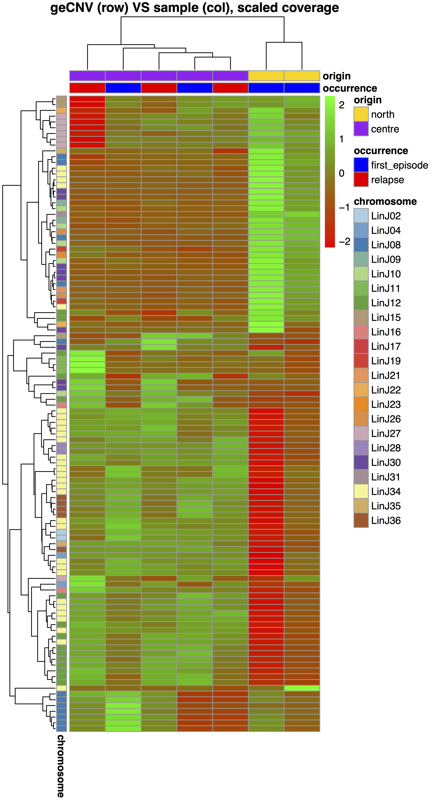
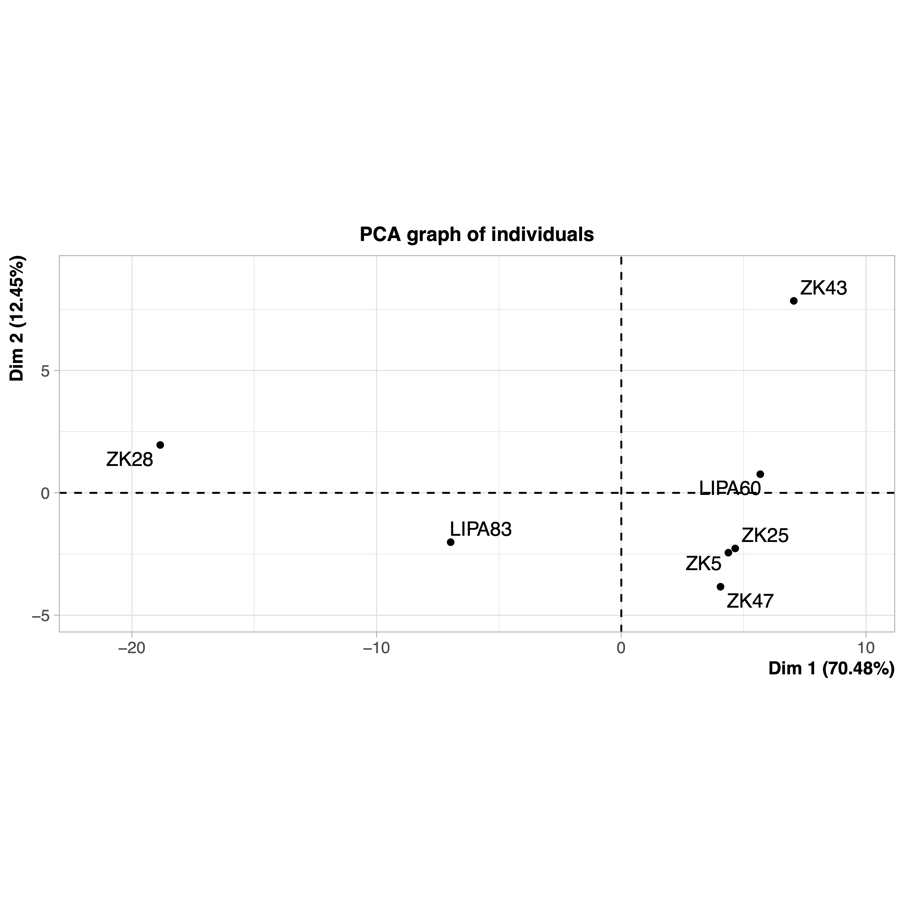
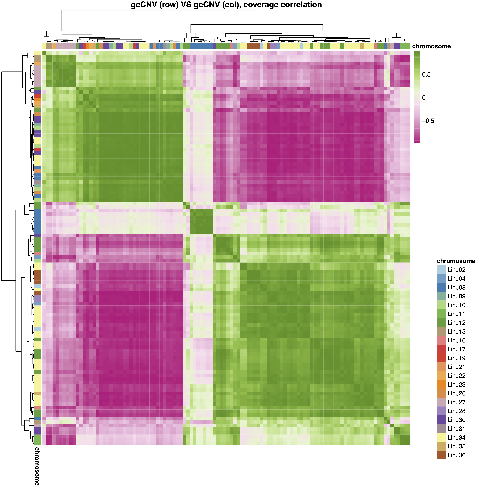
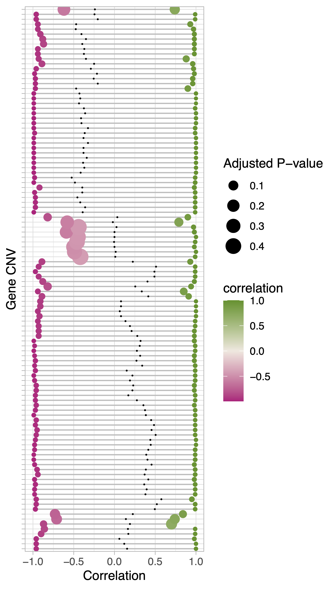
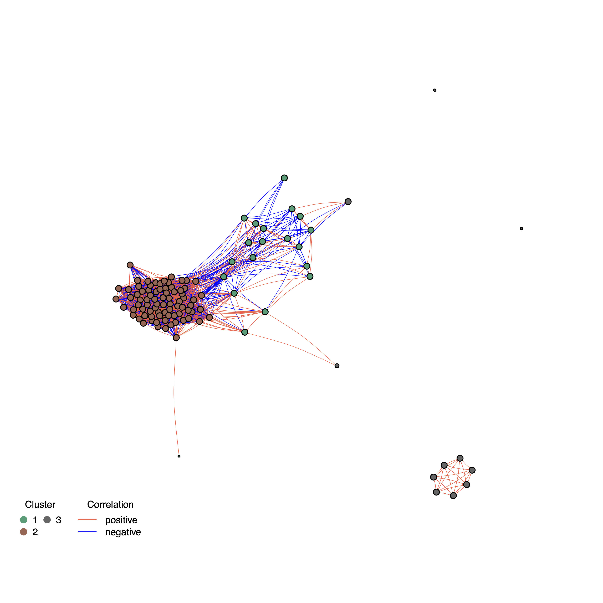

#############
geInteraction
#############

Options
-------

+-----------------------+--------------------------------------------------------------+----------------+
|Option                 |Description                                                   |Argument        |
+=======================+==============================================================+================+
|\-\-samplesList        |File with a column named \"sample\" listing samples names.    |[char]          |
|                       |                                                              |                |
|                       |Additional TSV columns will be used to annotate the output    |                |
|                       |                                                              |                |
|                       |figures. \"field\"_COLOR columns are used to map colors       |                |
|                       |                                                              |                |
|                       |to the additional fields [**required**]                       |                |
+-----------------------+--------------------------------------------------------------+----------------+
|\-\-gipOut             |GIP output directory [default gipOut]                         |[char]          |
+-----------------------+--------------------------------------------------------------+----------------+
|\-\-outName            |Output name [default gipOut/sampleComparison/geInteraction]   |[char]          |
+-----------------------+--------------------------------------------------------------+----------------+
|\-\-chrs               |Chromosomes to use. If "NA" it uses the same chromsomes as GIP|[char ...]      |
|                       |                                                              |                |
|                       |[default NA]                                                  |                |
+-----------------------+--------------------------------------------------------------+----------------+
|\-\-minMAPQ            |Remove genes with MAPQ < --MAPQ [default 0]                   |[int]           |
+-----------------------+--------------------------------------------------------------+----------------+
|\-\-minDelta           |Min normalized coverage delta between samples [default 1]     |[int]           |
+-----------------------+--------------------------------------------------------------+----------------+
|\-\-minMaxCov          |Use only genes with normalized coverage >Value1 or <Value2    |[num num]       |
|                       |                                                              |                |
|                       |in at least one sample.                                       |                |
|                       |                                                              |                |
|                       |If \"NA\" no filter is applied [default NA]                   |                |
+-----------------------+--------------------------------------------------------------+----------------+
|\-\-rmNotSigGenes      |Use only genes with significant coverage in at least          |                |
|                       |                                                              |                |
|                       |one of the samples                                            |                |
+-----------------------+--------------------------------------------------------------+----------------+
|\-\-heatmapType        |Gene normalized coverage value transformation used            |[scaled | log10 |
|                       |                                                              |                |
|                       |for the CNV vs samples heatmap.  [default scaled]             |saturated |     |
|                       |                                                              |                |
|                       |                                                              |flatten]        |
+-----------------------+--------------------------------------------------------------+----------------+
|\-\-covSaturation      |Gene normalized coverage saturation value. DEPENDENCY         |[int]           |
|                       |                                                              |                |
|                       |\-\-heatmapType \"saturated\" or \"flatten\" [default 3]      |                |
+-----------------------+--------------------------------------------------------------+----------------+
|\-\-quantileSaturation |Provide two numbers. Saturate the colors of the gene CNV      |[double double] |
|                       |                                                              |                |
|                       |vs samples heatmap for quantiles < num1 or > num2             |                |
|                       |                                                              |                |
|                       |DEPENDENCY \-\-heatmapType \"scaled\" or \"log10\""           |                |
|                       |                                                              |                |
|                       |[default 0 1]                                                 |                |
+-----------------------+--------------------------------------------------------------+----------------+
|\-\-doNotClusterSamples|Do not cluster heatmap columns.                               |                |
|                       |                                                              |                |
|                       |Show the samples in the same order as in \-\-samplesList      |                |
+-----------------------+--------------------------------------------------------------+----------------+
|\-\-clusteringMethod   |Heatmaps clustering method [default complete]                 |[ward.D2|ward   |
|                       |                                                              |                |
|                       |                                                              |single|complete | 
|                       |                                                              |                |
|                       |                                                              |average|mcquitty|
|                       |                                                              |                |
|                       |                                                              |median|centroid]|
+-----------------------+--------------------------------------------------------------+----------------+
|\-\cutree_cnv          |Based on the hierarchical clustering,                         |[int]           |
|                       |                                                              |                |
|                       |divide the genes in this number of clusters [default 1]       |                |
+-----------------------+--------------------------------------------------------------+----------------+
|\-\-cutree_samp        |Based on the hierarchical clustering, divide the samples      |[int]           |
|                       |                                                              |                |
|                       |in this number of clusters [default 1]                        |                |
+-----------------------+--------------------------------------------------------------+----------------+
|\-\-show_geneNames     |Show gene names in the heatmaps                               |                |
+-----------------------+--------------------------------------------------------------+----------------+
|\-\-show_sampNames     |Show sample names in the heatmaps                             |                |
+-----------------------+--------------------------------------------------------------+----------------+
|\-\-cnvPlotDim         |CNVs vs samples heatmap file height and                       |[double double] |
|                       |                                                              |                |
|                       |width values [default 11 6]                                   |                |
+-----------------------+--------------------------------------------------------------+----------------+
|\-\-corPlotDim         |CNVs vs CNVs heatmap file height and                          |[double double] |
|                       |                                                              |                |
|                       |width values [default 11 11]                                  |                |
+-----------------------+--------------------------------------------------------------+----------------+
|\-\-lolPlotDim         |Lollipop plot file height and                                 |[double double] | 
|                       |                                                              |                |
|                       |width values [default 7 4]                                    |                |
+-----------------------+--------------------------------------------------------------+----------------+
|\-\-kmeansClusters     |NETWORK. Use this number of k-means clusters for              |[int]           |
|                       |                                                              |                |
|                       |network clustering. If \"NA\" use mclust [default NA]         |                |
+-----------------------+--------------------------------------------------------------+----------------+
|\-\-MCLinflation       |NETWORK. Use this inflation MCL value for network clustering. |[int]           |
|                       |                                                              |                |
|                       |Higher inflation values result in increased                   |                |
|                       |                                                              |                |
|                       |cluster granularity. If \"NA\" use mclust  [default NA]       |                |
+-----------------------+--------------------------------------------------------------+----------------+
|\-\-MCLexpansion       |NETWORK. MCL expansion value.                                 |[int]           |
|                       |                                                              |                |
|                       |DEPENDENCY \-\-MCLinflation not \"NA\" [default 2]            |                |
+-----------------------+--------------------------------------------------------------+----------------+
|\-\-clMaxSDdist        |NETWORK. Gene CNVs with distance from the cluster             |[double]        | 
|                       |                                                              |                |
|                       |centroid > \-\-clMaxSDdist standard deviations from the       |                |
|                       |                                                              |                |
|                       |mean distance are removed from the cluster. High values make  |                |
|                       |                                                              |                |
|                       |this filter unffective. [default Inf]                         |                |
+-----------------------+--------------------------------------------------------------+----------------+
|\-\-clMinSize"         |NETWORK. Min number of members in a cluster [default 2]       |[int]           |
+-----------------------+--------------------------------------------------------------+----------------+
|\-\-edgesMeanCorFilter |NETWORK. Remove edges representing CNV correlation scores     |                |
|                       |                                                              |                |
|                       |lower than the mean absolute CNV correlation                  |                |
+-----------------------+--------------------------------------------------------------+----------------+
|\-\-edgesPvalueFilter  |NETWORK. Remove edges with adjusted pvalue                    |[double]        |
|                       |                                                              |                |
|                       |below this threshold  [default 0.1]                           |                |
+-----------------------+--------------------------------------------------------------+----------------+  
|\-\-debug              |Dump session and quit                                         |                |
+-----------------------+--------------------------------------------------------------+----------------+
|\-h, \-\-help          |Show help message                                             |                |
+-----------------------+--------------------------------------------------------------+----------------+

Description
-----------

The ``geInteraction`` module aims at detecting CNV genes across multiple samples and identifying gene interactions using a correlation-based network approach.
The module loads the GIP files with the gene sequencing coverage values (.covPerGe.gz files) of all samples, then selects CNV genes. These are defined as the genes with a normalized coverage variation within the sample set greater than --minDelta. Next it builds a network and evaluates clusters based on the correlation computed between all CNV gene pairs.
The heatmapType parameter has 4 options. If \"scaled\" values are first centered subtracting the mean gene normalized coverage across samples, then scaled dividing by the standard deviation. If \"log10\" values are log10 transformed. If \"saturated\" values are saturated at \-\-covSaturation. If \"flatten\" values are first subracted by the min gene normalized coverage across samples, then saturated at \-\-covSaturation. The latter visualization option is useful to appreciate coverage variations of genes that are highly amplified in all samples.

The second part of this module is about producing correlation networks.
First the module computes a all vs all CNV absolute correlation matrix. Then it predicts gene CNV clusters using mclust, MCL or a kmeans approach. Next, the module applies a filtering routine in which the user can remove small clusters or gene CNVs placed at a significant distance from the cluster centroid. To do that, for each cluster the module measures the centroid, the mean euclidian distance and the standard deviation. Cluster members whose distance from the centroid is greater than ``--clMaxSDdist`` standard deviations from the mean are removed.

Example
-------
| From the GIP worked example folder execute

| ``giptools geInteraction --samplesList samplesMetaData``

| This will generate the geInteraction output files in the **gipOut/sampleComparison** folder.
| The ``geInteraction`` module requires to specifty the ``--samplesList`` parameter providing a tab separated file where the first column is the list of the sample names to be processed. Optionally columns can be passed with additional sample meta data information (e.g. drug resistance, geographic origin, operator) and the colors to by assigned to each feature. If no color is provided this will be assigned randomly. In this example the sampleMetaData file is :download:`this <../_static/samplesMetaData.pdf>`. The output of this module consists of eight files.

| The **geInteraction.CNV.pdf** file includes a heatmap showing the normalized coverage of the detected CNV genes. The default is scaling the normalized coverage values but other data transformations are possible (see above). The ``--cutree_samp`` and ``--cutree_cnv`` can be used to split the heatmap at the sample (columns) and CNV (rows) levels respectively. 
| The figure produced in this example is the following:

| The **geInteraction.overview.pdf** file includes multiple plots. The first plot represents the PCA analysis of the samples based on detected gene CNVs. Supplementary plots are produced for each additional meta data field. In these plots the samples are colored by the meta data information. The last plot represents two histograms showing respectivelly the standard deviation and the entropy of the gene CNV normalized coverage. The PCA plot in this example is the following:

| The **geInteraction.corr.pdf** file reports the all vs all gene CNV correlation heatmap. The ``--cutree_cnv`` option can be used to split the CNVs (both on the columns and rows) in different groups. 

| The **geInteraction.lolli.pdf** file demonstates for each gene CNV (rows) the most negative correlation (left side, pink), the median correlation (black dot), and the most positive correlation (right side, green) values measured among the gene CNVs. The gene CNV order is the same as the one in the all vs all gene CNV heatmap. 

| The **geInteraction.network.pdf** file reports the gene CNV correlation network, where the nodes represent the genes, the edges the correlation values, and the color of the edges the correlation direction (positive or negative). The nodes are colored according to the predicted clusters. Multiple clustering methods are offered. For instance addind to the command line the option ``--kmeansClusters 3`` returns the following plot:

| The **geInteraction.network.d3.html** is a D3 interactive vidualization of the network. While the network layout may be slightly different than the static visualization (due to the differences between the tools used to generate the two), the node clusters and the overall shape are the same.

| The **geInteraction.CNV.xlsx** includes thee spreadsheets:

1. sampleInfo. This is a copy of the provided sample meta data showinf the features colors and reporting the sample branch group assignment in the **geInteraction.CNV.pdf** heatmap.
2. cnvInfo. This table includes the relevant statistics measured for the detected gene CNVs, including the most positivelly and negativelly correated genes partners, and the gene CNV branch group assignment in the **geInteraction.CNV.pdf** and **geInteraction.corr.pdf** heatmaps.
3. normGeneCoverage. This table includes the normalized gene coverage across the samples of interest.

| The **geInteraction.network.xlsx** includes a different spreadsheet for each predicted network correlation group. Each of them reports the gene members, their functions (if available) and the all vs all correlation values. The last spreadsheet reports the list of genes filtered from the network (if any).

