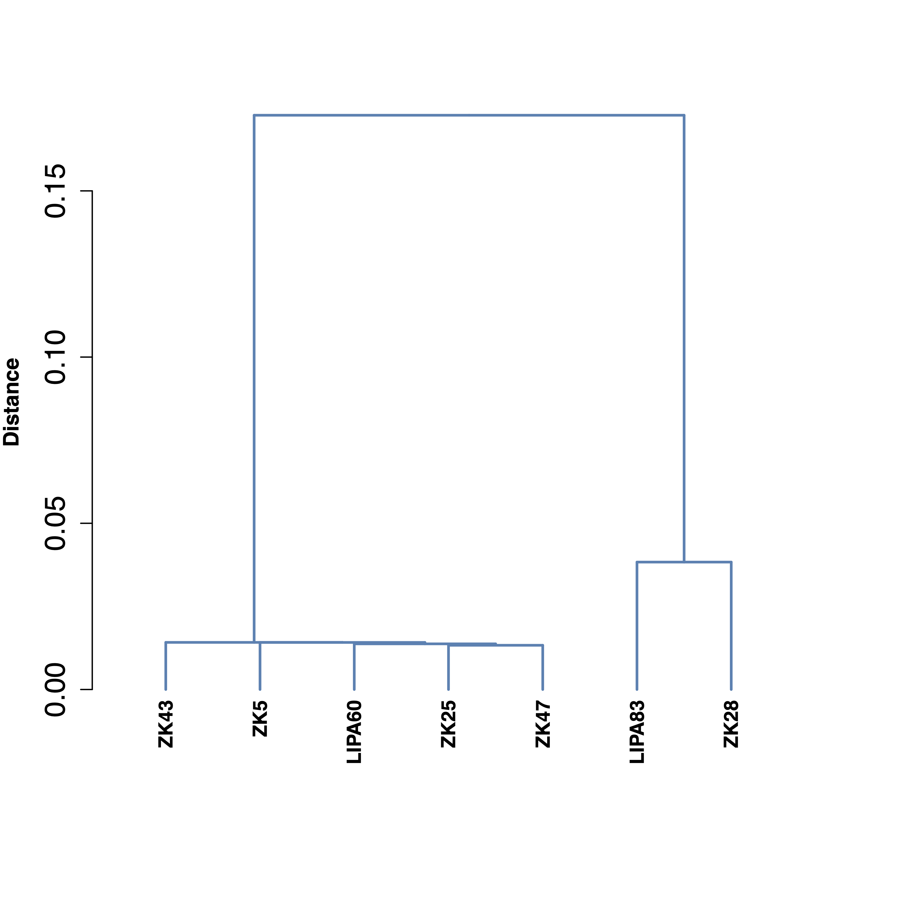
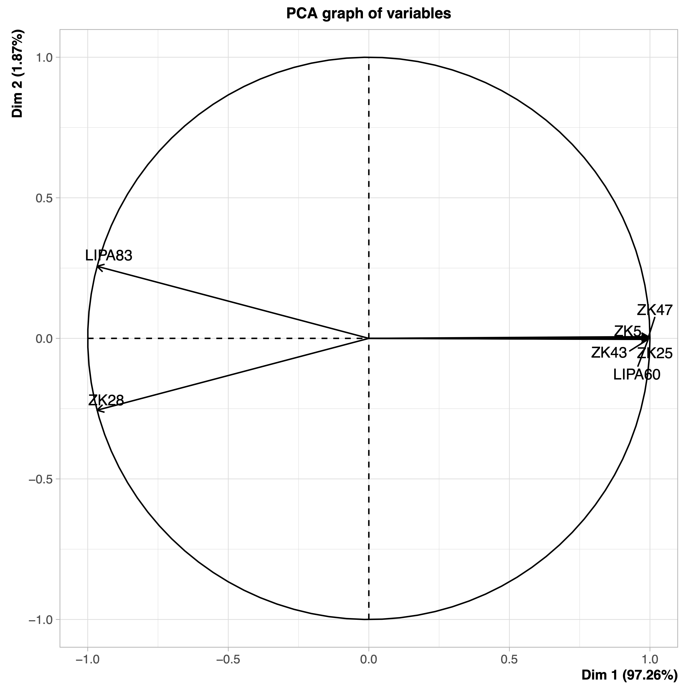

##############
genomeDistance
##############

Options
-------

+----------------------+------------------------------------------------------+-----------+
|Option                |Description                                           |Argument   |
+======================+======================================================+===========+
|\-\-samples           |Sample names. It determines the plotting order        |[char ...] |
|                      |                                                      |           |
|                      |If "NA" all samples are used [default NA]             |           |
+----------------------+------------------------------------------------------+-----------+
|\-\-gipOut            |GIP output director [default gipOut]                  |[char]     |
+----------------------+------------------------------------------------------+-----------+
|\-\-outName           |Output name                                           |[char]     |
|                      |                                                      |           |
|                      |[default gipOut/sampleComparison/genomeDistance]      |           |
+----------------------+------------------------------------------------------+-----------+
|\-\-contextGenomes    |Two columns TSV file listing additional genomes.      |[char]     |                
|                      |                                                      |           |
|                      |Syntax: name<Tab>filePath [default NA]                |           |
+----------------------+------------------------------------------------------+-----------+
|\-\-customColors      |TSV file with 2 columns named "SAMPLE" and "COLOR"    |[char]     |
|                      |                                                      |           |
|                      |indicating the color to be used for each sample. If   |           |
|                      |                                                      |           |
|                      |"NA" colors are automatically assigned [default NA]   |           |
+----------------------+------------------------------------------------------+-----------+ 
|\-\-phylogenyDistance |Distance matrix e.g. the phylogeny.treefile.distMat.gz|[char]     |
|                      |                                                      |           |
|                      |file produced with the phylogeny module.              |           |
|                      |                                                      |           |
|                      |If "NA" the ANI distance is measured [dafault NA]     |           |
+----------------------+------------------------------------------------------+-----------+
|\-\-PCAlabel          |Show PCA labels [default all]                         |[all|none] |
+----------------------+------------------------------------------------------+-----------+
|\-\-debug             |Dump session and quit                                 |           |
+----------------------+------------------------------------------------------+-----------+
|\-h, \-\-help         |Show help message                                     |           |
+----------------------+------------------------------------------------------+-----------+

Description
-----------
| The ``genomeDistance`` module is meant to compare the genomic distance of the samples of interest. 
| For each sample the module loads the genome file embedding the predicted filtered SNVs (pseudoReference.fa.gz files), then measures the ANI (average nucleotide identity) scores between all sample pairs. The resulting distance is then used to run a principal component analysis (PCA) and produce a dendrogram plot demonstrating the measured distances.  
| Alternatively this module can be use to generate distance plots of a custom input matrix generated with the ``phylogeny`` module. 

Example
-------
| From the GIP worked example folder execute

| ``giptools genomeDistance``

| This will generate the two genomeDistance output files in the **gipOut/sampleComparison** folder.
| The **genomeDistance.pdf** file include dendrogram and PCA plot representations of the genomic distances between samples. For example, the dendrogram and the PCA graph of variables generated in this example are the following:

| The **genomeDistance.xlsx** file reports the computed ANI scores for all sample pairs.

