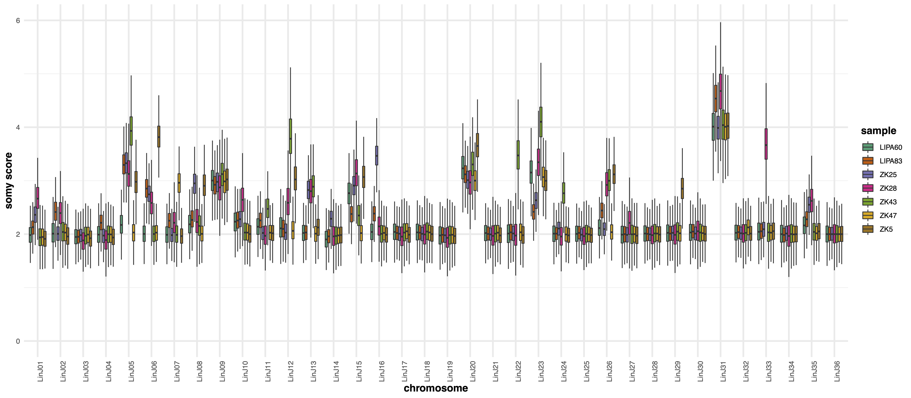
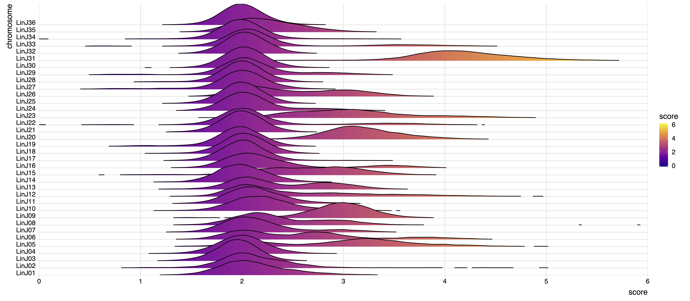

#########
karyotype
#########

Options
-------

+-------------------+------------------------------------------------------------------+----------------+
|Option             |Description                                                       |Argument        |
+===================+==================================================================+================+
|\-\-samples        |Sample names. It determines the plotting order                    |[char ...]      |
|                   |                                                                  |                |
|                   |If "NA" all samples are used [default NA]                         |                |
+-------------------+------------------------------------------------------------------+----------------+
|\-\-gipOut         |GIP output directory. If "NA" the directory "./gipOut" is used    |[char]          |
|                   |                                                                  |                |
|                   |[default NA]                                                      |                |
+-------------------+------------------------------------------------------------------+----------------+
|\-\-outName        |Output name [default NA]                                          |[char]          |
+-------------------+------------------------------------------------------------------+----------------+
|\-\-minMAPQ        |Remove bins with MAPQ < --MAPQ [default 0]                        |[int]           |
+-------------------+------------------------------------------------------------------+----------------+
|\-\-chrs           |Chromosomes to use. If "NA" it uses the same chromsomes as GIP    |[char ...]      |
|                   |                                                                  |                |
|                   |[default NA]                                                      |                |
+-------------------+------------------------------------------------------------------+----------------+  
|\-\-ylim           |Min and max plot y-axis limits [default (0, 10)]                  |[int] [int]     |
+-------------------+------------------------------------------------------------------+----------------+
|\-\-makeQqplots    |Computes Q-Q plots for all chromosomes in all samples combinations|                |
+-------------------+------------------------------------------------------------------+----------------+
|\-\-disomicChr     |Normalize by this chromosome [default NA]                         |[char]          |
+-------------------+------------------------------------------------------------------+----------------+  
|\-\-customColors   |Tab-separated file where the first 2 columns are:                 |[char]          |
|                   |                                                                  |                |
|                   |  * SAMPLE: samples names                                         |                |
|                   |  * COLOR:  associated colors                                     |                |
|                   |                                                                  |                |
|                   |[default NA]                                                      |                |
+-------------------+------------------------------------------------------------------+----------------+  
|\-\-geom           |Select boxplot or violin [default boxplot]                        |[boxplot|violin]|
+-------------------+------------------------------------------------------------------+----------------+
|\-\-pooled         |Pool all samples together (i.e. one box per chromosome            |                |
|                   |                                                                  |                |
|                   |representing the coverage values of all samples)                  |                |
+-------------------+------------------------------------------------------------------+----------------+  
|\-\-debug          |Dump session and quit                                             |                |
+-------------------+------------------------------------------------------------------+----------------+
|\-h, \-\-help      |Show help message                                                 |                |
+-------------------+------------------------------------------------------------------+----------------+

Description
-----------

| The ``karyotype`` module aims at comparing the chromosome sequencing coverage distributions of multiple samples. This module is useful when trying to detect chromosome ploidy differences in different isolates.
| For each sample the module loads the GIP files with the bin sequencing coverage (.covPerBin.gz files) and normalizes the meancoverage values by the median coverage of all bins. The bin scores are then converted to *somy scores* which are then used for producing plots and statistics.

The ``--disomicChr`` option is useful to recenter somy scores on a user defined disomic chromosome.
Under the assumption that most of the genome is disomic, the somy score is simply calculated multiplying by two the bin scores.
However, depending on the biological system under investigation, many/most chromosomes may show aneuploidy. 
In this case the somy score distribution of a given disomic chromosome may not be exactly centered on 2, and different samples may give slightly shifted readout for the same disomic chromosome.
To address this problem the user can perform a first run of ``giptools karyotype``  to identify a chromosome whose median coverage is as close as possible to a value of 2, and that it is stable across the samples set. In a second run of ``giptools karyotype`` the user can then specify the chromsome name with the ``--disomicChr`` option.
By doing that the somy scores will be calculated by dividing the bins coverage scores by the median score of the chromosome deemed to be disomic and then multiplied by 2.

To compare coverage distribution shapes the script can optionally generate Q-Q plots (slow), comparing the quantiles of the two bins distributions. If the dots (quantiles) are on the diagonal, then their distributions have the same shape.

Example
-------

| From the GIP worked example folder execute

| ``giptools karyotype``

| This will generate the karyotype output files in the **gipOut/sampleComparison** folder. A second run of this module can be performed to adjust the visualization parameters (e.g. reducing the range on the y-axis) and normalize by the LinJ36 disomic chromosome:

| ``giptools karyotype  --ylim 0 6 --disomicChr LinJ36``
 

Output
------

| The otput consists in two files: 

* A .pdf file including two plots
* An .xlsx files with 5 data sheets

 
The two plots represent the chromosome somy scores as boxplots and density distributions. 
The example produces the following plots:

 

The ``karyotype`` module performs the Wilcoxon, Kolmogorov-Smirnov and AOV tests on the somy score distributions to test the significance of chromosome coverage variations in the different samples. The output statistics are reported in the .xlsx file which includes the following data sheets:
  
* Wilcoxon tes p-value scores
* Kolmogorov-Smirnov (KS) test p-value scores
* One way ANOVA test (AOV) p-value scores
* Difference between the normalized median chromosome coverage scores
* Normalized median chromosome coverage scores

