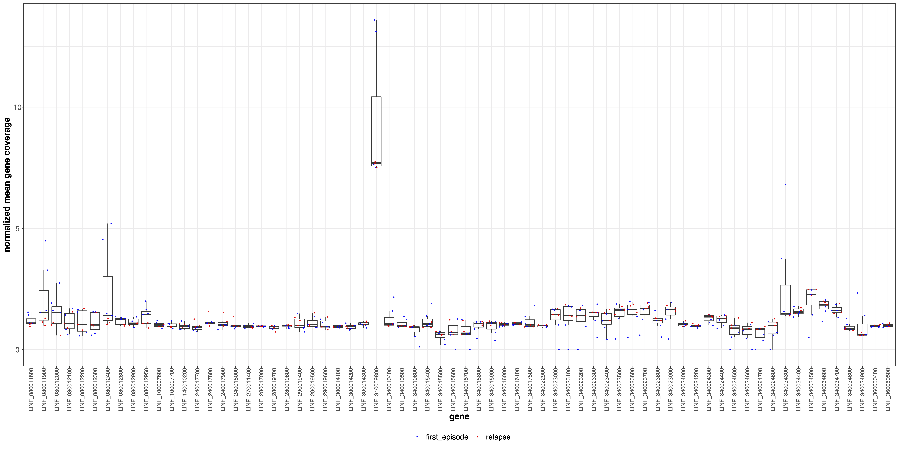

#####
panel
#####

Options
-------

+--------------------+------------------------------------------------------------------+---------------+
|Option              |Description                                                       |Argument       |
+====================+==================================================================+===============+
|\-\-samplesList     |File with a column named "sampleId" listing samples names,        |[char]         |
|                    |                                                                  |               |
|                    |plus two TSV columns specifying respectively sample sets          |               |               
|                    |                                                                  |               |
|                    |and colors [required]                                             |               |
+--------------------+------------------------------------------------------------------+---------------+
|\-\-gipOut          |GIP output directory [default gipOut]                             |[char]         |
+--------------------+------------------------------------------------------------------+---------------+
|\-\-outName         |Output name [default gipOut/sampleComparison/panel]               |[char]         |
+--------------------+------------------------------------------------------------------+---------------+
|\-\-panel           |File with three columns named "gene_id", "set" and "color"        |[char]         |
|                    |                                                                  |               |
|                    |listing respectively the gene ID, the panel group, and the color  |               |
|                    |                                                                  |               |
|                    |[required]                                                        |               |
+--------------------+------------------------------------------------------------------+---------------+
|\-\-addBackground   |Number of random non-panel genes to be added and shown in         |[int|          |
|                    |                                                                  |               |
|                    |scatterplots. If "all" all non-panel genes are added.             |"all"|"none"]  |
|                    |                                                                  |               |
|                    |If "none" no genes are added [default none]                       |               |
+--------------------+------------------------------------------------------------------+---------------+
|\-\-covNorm         |Plot gene coverage normalized by                                  |["chromosome"| |
|                    |                                                                  |               |
|                    |[chromosome|genome] median coverage[default genome]               |"genome"]      |
+--------------------+------------------------------------------------------------------+---------------+  
|\-\-covPlotDim      |Gene coverage plot height and width values [default 10 20]        |[double double]| 
+--------------------+------------------------------------------------------------------+---------------+
|\-\-varPlotDim      |Gene variants plot height and width values [default 10 20]        |[double double]| 
+--------------------+------------------------------------------------------------------+---------------+
|\-\-contrast        |Compare samples from these two sets.                              |[char char]    | 
|                    |                                                                  |               |
|                    |If "NA" all samples are considered from the same set [defaul NA]  |               |
+--------------------+------------------------------------------------------------------+---------------+
|\-\-debug           |Dump session and quit                                             |               |
+--------------------+------------------------------------------------------------------+---------------+
|\-h, \-\-help       |Show help message                                                 |               |
+--------------------+------------------------------------------------------------------+---------------+

Description
-----------

| The ``panel`` module aims at extracting and summarizing the normalized coverage and synonimous (S) and non-synonimous (N) SNV information for one or more gene panels in one or more sample sets. The gene panels are specified with the ``--panel`` parameter. The sample sets are specified with the ``--sampleList`` parameter. Optionally the use can compare N, S and coverage statistics in two sample sets of interest by specifying the set names with the ``--contrast`` parameter.   

Example
-------

| From the GIP worked example folder execute

| ``giptools panel --sampleList sampleList.tsv --panel panel.tsv``

| This will generate the panel output files in the **gipOut/sampleComparison** folder. 

| The sampleList.tsv is a Tab Separated Value table like :download:`this <../_static/sampleListExample.pdf>`.

| The panel.tsv is a separate Tab Separated Value table listing a panel of genes of interest, in this example :download:`68 amastin genes <../_static/panelExample.pdf>`.

| The output consists of three files: 

* The .coverage.pdf file includes multiple plots showing the sequencing coverage of the genes in the panel normalized by median genomic coverage
* The .variants.pdf file represents the counts of N and S mutations for each gene in the panel
* The panel.xlsx file is an excel table reporting the normalized coverage, the N and S counts for each gene.

| For example, one of the coverage plot produced shows the distribution of coverage for each gene (boxes) together with the coverage in individual samples (dots) colored by sample set (first-episode vs relapse infection in this example):

 
| The .variants.pdf file offers alternative visualizations of the N and S mutations. For instance, a stacked barplot showing the mean N and S counts for each gene:

 .. figure:: ../_static/panel.variants.png
      :width: 100 %

