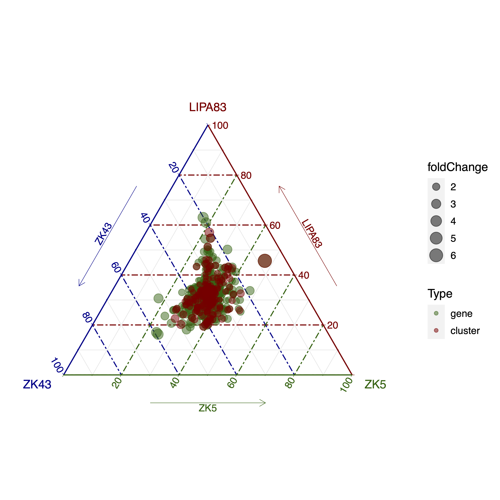
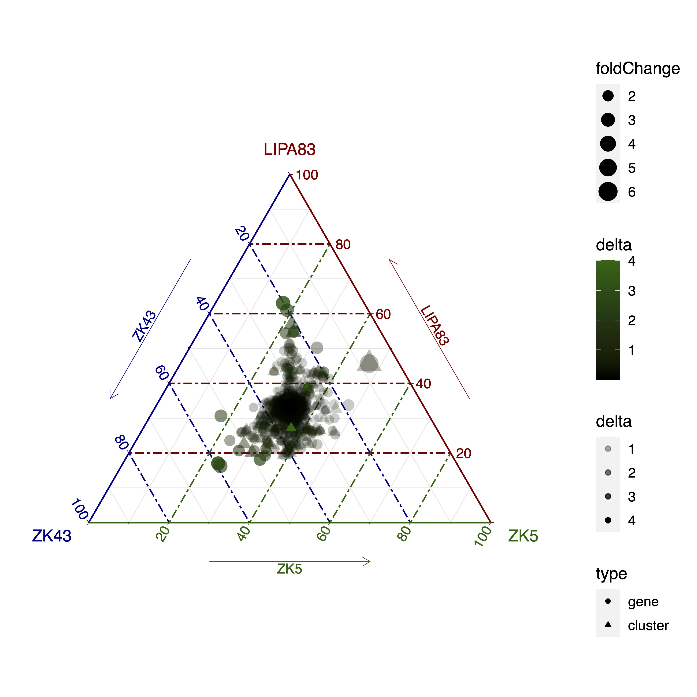
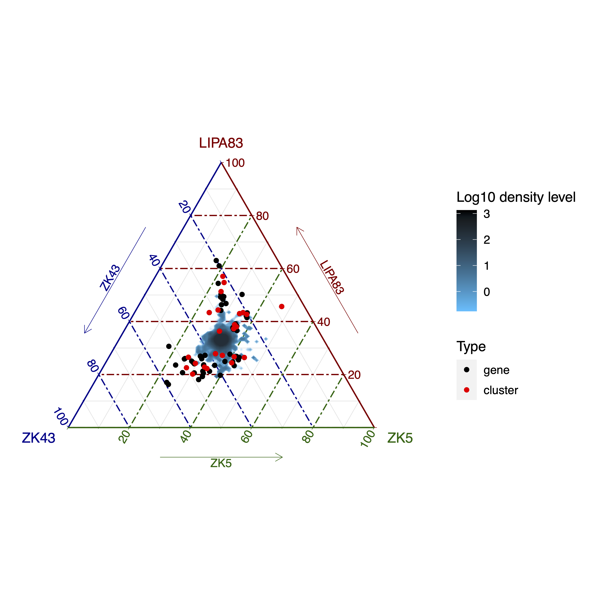
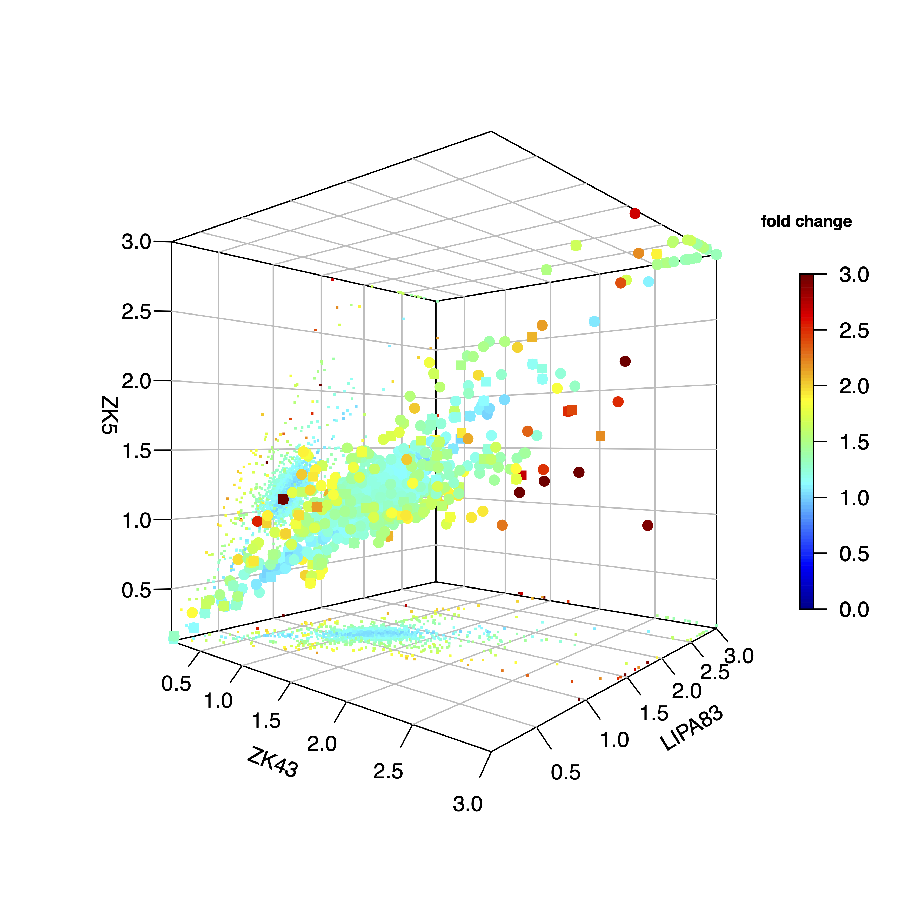

#######
ternary
#######

Options
-------

+-----------------------+--------------------------------------------------------------+----------------+
|Option                 |Description                                                   |Argument        |
+=======================+==============================================================+================+
|\-\-samples            |Sample names. It determines the plotting order [**required**] |[char ...]      |     
+-----------------------+--------------------------------------------------------------+----------------+
|\-\-gipOut             |GIP output directory [default gipOut]                         |[char]          |
+-----------------------+--------------------------------------------------------------+----------------+
|\-\-outName            |Output name [default gipOut/sampleComparison/ternary]         |[char]          |
+-----------------------+--------------------------------------------------------------+----------------+
|\-\-chrs               |Chromosomes to use. If "NA" it uses the same chromsomes as GIP|[char ...]      |
|                       |                                                              |                |
|                       |[default NA]                                                  |                |
+-----------------------+--------------------------------------------------------------+----------------+
|\-\-MAPQ               |Label genes with MAPQ < --MAPQ [default 0]                    |[int]           |
+-----------------------+--------------------------------------------------------------+----------------+
|\-\-pseudocount        |Normalized mean coverage                                      |[double]        |
|                       |                                                              |                |
|                       |pseudocount value (for plots only)  [default 0.1]             |                |
+-----------------------+--------------------------------------------------------------+----------------+
|\-\-colorByDelta       | Color genes by increasing delta                              |                |
+-----------------------+--------------------------------------------------------------+----------------+
|\-\-highLowDeltaColor  | Colors for high and low delta.                               |[char char]     |
|                       |                                                              |                |
|                       | DEPENDENCY \-\-colorByDelta  [default darkgreen black]       |                |
+-----------------------+--------------------------------------------------------------+----------------+
|\-\-showDensity        | Show log 10 scaled density area                              |                |
+-----------------------+--------------------------------------------------------------+----------------+
|\-\-highLowDensityColor| Colors for high and low density                              |[char char]     |
|                       |                                                              |                |
|                       | DEPENDENCY \-\-showDensity. [default black deepskyblue]      |                |
+-----------------------+--------------------------------------------------------------+----------------+
|\-\-showQuantile       |Show genes/clusters with a delta coverage greater than this   |[double]        | 
|                       |                                                              |                |
|                       |quantile cut-off. DEPENDENCY --showDensity [default 0.99]     |                |
+-----------------------+--------------------------------------------------------------+----------------+
|\-\-densityN           |Number of grid points in each direction                       |[int]           | 
|                       |                                                              |                |
|                       |DEPENDENCY --showDensity [default 200]                        |                |
+-----------------------+--------------------------------------------------------------+----------------+
|\-\-densityBins        |Number bins over which to calculate intervals                 |[int]           | 
|                       |                                                              |                |
|                       |DEPENDENCY --showDensity [default 8000]                       |                |
+-----------------------+--------------------------------------------------------------+----------------+
|\-\-plot3dMaxCOV       | 3-D scatteplot visualization threshold.                      |[double]        |
|                       |                                                              |                |
|                       | Gene/cluster coverage values greather than this threshold    |                |
|                       |                                                              |                |
|                       | are shown as \-\-plot3dMaxCOV  [default 3]                   |                |
+-----------------------+--------------------------------------------------------------+----------------+
|\-\-plot3dMaxFC        | 3-D scatteplot visualization threshold. Gene/cluster coverage|[double]        |
|                       |                                                              |                |
|                       | fold change values greather than this threshold              |                |
|                       |                                                              |                |
|                       | are shown as \-\-plot3dMaxFC [default 3]                     |                |
+-----------------------+--------------------------------------------------------------+----------------+  
|\-\-debug              |Dump session and quit                                         |                |
+-----------------------+--------------------------------------------------------------+----------------+
|\-h, \-\-help          |Show help message                                             |                |
+-----------------------+--------------------------------------------------------------+----------------+

Description
-----------
| The ``ternary`` module aims at comparing the gene sequencing coverage of 3 samples to identify gene CNVs.
| The module loads for the three samples the GIP files with the gene sequencing coverage values (.covPerGe.gz files) and generates a ternary diagram of the normalized coverage values. In this representation, the values coverage values in the 3 samples sum to a constant represented for convenience as 100%. Additionally, the module generates a 3D-scatterplot demonstrating the normalized gene coverage in the 3 samples.
 

Example
-------

| From the GIP worked example folder execute

| ``giptools ternary --samples ZK43 LIPA83 ZK5``

| This will generate the ternary output files in the **gipOut/sampleComparison** folder.
| The output consists in two files. 

| The **ternary.pdf** file includes a triangular plot showing the relative size of the normalized coverage values of each gene in the three samples. In the default representation genes and gene clusters (if present) are shown in different color, and the size of the dots reflects the fold change between the max and the min normalized coverage in the three samples. The triangular plot for this example is the following:

| The user can customize this plot specifying different colors and different visualization options. For instance, adding the ``--colorByDelta`` option will result in the following plot, in which the delta coverage (defined as the difference between the max and min normalized coverage) is colored in a customizable scale whose intensity reflects the delta coverage size. 

| The ``--showDensity`` option will result in a log10 scaled density representation of the genes (and gene clusters if present). 
| The ``--showQuantile`` option regulates the number of high-delta coverages and gene clusters to be shown together with the density plot. Please note that high copy genes can have high delta coverage values, but still be placed roughly in the middle of the triangular plot. For instance, in this representation a gene present in the three samples in 12, 10 and 10 copies will be more central than a gene with 3, 1 and 1 copies. While the delta value is the same (2), the fold change is very different in the two cases (respectivelly 1.2 and 3). The triangular plot with the density option in this example is the following:

| The **ternary.pdf** file includes a second plot representing a 3D-scatterplot showing the normalized coverage values of all genes (dots) in the three samples colored by normalized coverage fold change. To ease the visualization, each dot is projected to the bottom and back planes and represented by a smaller dot. If present, gene clusters are represented by squares. In this example the 3d-plot is the following:

 

| The **ternary.xlsx** file reports for each gene the genomic coordinates, the computed normalized coverage scores, the delta coverage and fold change values in the three samples, the overlap of the gene with gap and predicted repetitive elements, and if available the gene function. If available, the gene cluster data are reported in a second separate spreadsheet.

