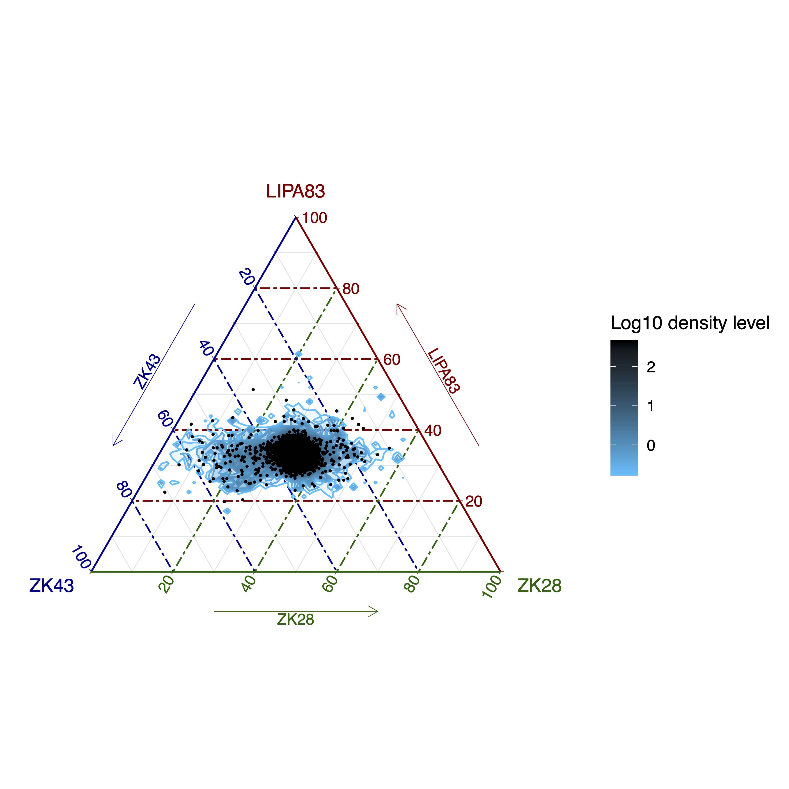

##########
ternaryBin
##########

Options
-------

+-----------------------+--------------------------------------------------------------+----------------+
|Option                 |Description                                                   |Argument        |
+=======================+==============================================================+================+
|\-\-samples            |Sample names. It determines the plotting order [**required**] |[char ...]      |     
+-----------------------+--------------------------------------------------------------+----------------+
|\-\-gipOut             |GIP output directory [default gipOut]                         |[char]          |
+-----------------------+--------------------------------------------------------------+----------------+
|\-\-outName            |Output name [default gipOut/sampleComparison/ternaryBin]      |[char]          |
+-----------------------+--------------------------------------------------------------+----------------+
|\-\-chrs               |Chromosomes to use. If "NA" it uses the same chromsomes as GIP|[char ...]      |
|                       |                                                              |                |
|                       |[default NA]                                                  |                |
+-----------------------+--------------------------------------------------------------+----------------+
|\-\-minMAPQ            |Remove bins with MAPQ < --MAPQ [default 0]                    |[int]           |
+-----------------------+--------------------------------------------------------------+----------------+
|\-\-pseudocount        |Normalized mean coverage                                      |[double]        |
|                       |                                                              |                |
|                       |pseudocount value (for ternary plot only)  [default 0.1]      |                |
+-----------------------+--------------------------------------------------------------+----------------+
|\-\-highLowDensityColor|Colors for high and low density [default black deepskyblue]   |[char char]     |
+-----------------------+--------------------------------------------------------------+----------------+
|\-\-densityN           |Number of grid points in each direction  [default 200]        |[int]           |
+-----------------------+--------------------------------------------------------------+----------------+
|\-\-densityBins        |Number bins over which to calculate intervals [default 8000]  |[int]           |
+-----------------------+--------------------------------------------------------------+----------------+
|\-\-showSubset         |Show a random subset of genomic bins.                         |[int]           |
|                       |                                                              |                |
|                       |Does not affect the density estimation   [default 5000]       |                |
+-----------------------+--------------------------------------------------------------+----------------+  
|\-\-debug              |Dump session and quit                                         |                |
+-----------------------+--------------------------------------------------------------+----------------+
|\-h, \-\-help          |Show help message                                             |                |
+-----------------------+--------------------------------------------------------------+----------------+

Description
-----------
| The ``ternaryBin`` module aims at comparing the bin sequencing coverage of 3 samples to identify CNVs regions.
| The module loads for the three samples the GIP files with the bin sequencing coverage values (.covPerBin.gz files) and generates a ternary diagram of the normalized coverage values. In this representation, the values coverage values in the 3 samples sum to a constant represented for convenience as 100%. Depending on the genome size the number of bins can be very large. To ease plot readability and lower the CPU requirements this module generates a 2D kernel density estimatation of the data, and materializes just a random subset of genomic bins as dots.

Example
-------
| From the GIP worked example folder execute

| ``giptools ternaryBin --samples ZK43 LIPA83 ZK28``

| This will generate the ternaryBin output files in the **gipOut/sampleComparison** folder.
| The user can test different vaules of ``--densityN`` and ``--densityBins`` to adjust the density area representation. For instance adding to the previous example the parameters  ``--densityN 150 --densityBins 3000`` results in the following plot:

| The **ternaryBin.xlsx** file reports for each bin the genomic coordinates, the computed normalized coverage scores, the minimum MAPQ score, the delta coverage and fold change values in the three samples.

