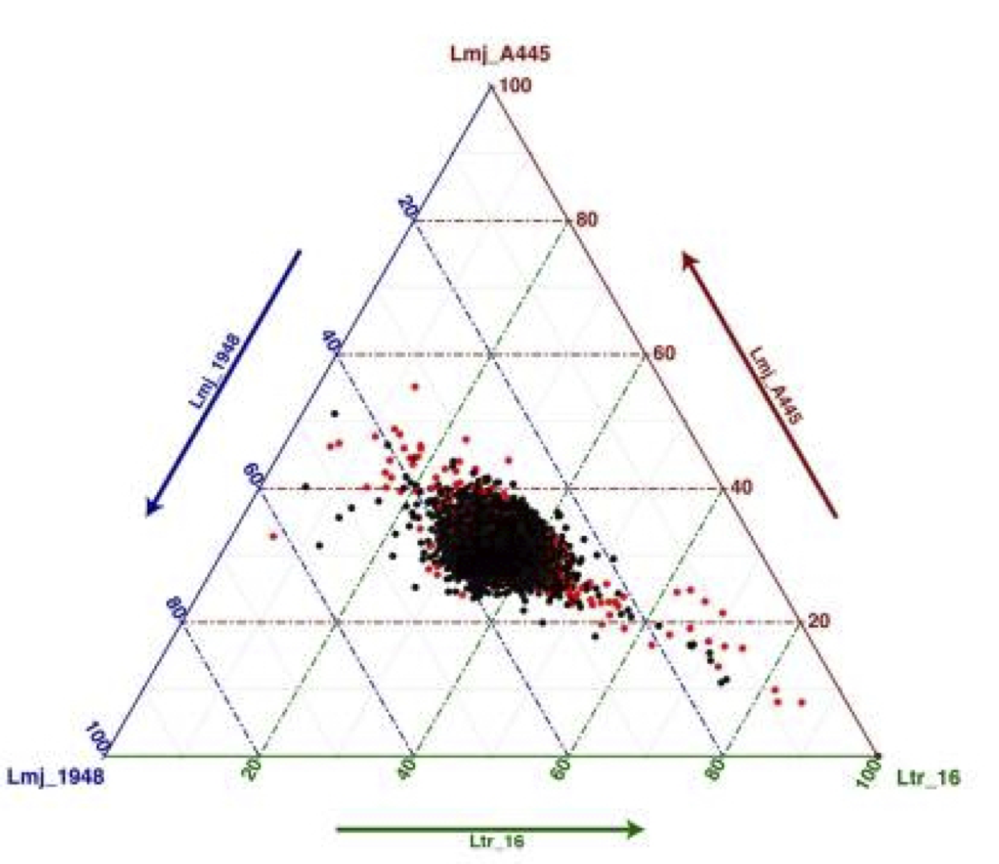

.. GIP documentation master file, created by
   sphinx-quickstart on Mon Sep 14 10:59:47 2020.
   You can adapt this file completely to your liking, but it should at least
   contain the root `toctree` directive.
   
   image:: _static/logo.jpg
    :width: 120px
    :alt: GIP logo
    :align: center

Genome Instability Pipeline
===========================

The Genome Instability Pipeline (GIP) will solve your problem of analyzing whole genome sequencing (WGS) data 
making bioinformatics screenings faster and easier
GIP allows the batch processing of multiple WGS experiments, including the mapping of short reads, the quantification of chromosomes, genes and genomic bins.
The results of GIP are summarized in a *report* page providing sequencing experiment and mapping statistics, graphical representations of genomic features quantifications, and excel tables.

GIP also enables **giptools**, a tool-suite allowing to  **detect**, **compare** and **visualize** 

* aneuploidy changes
* gene copy number variants (CNVs)
* single nucleotide variants (SNVs)
* structural variants (SVs)

Look how easy it is to use.
Run GIP on a large set of input WGS experiments (e.g. 200 samples)

  ``nextflow gip.nf --genome sequenceFile --annotation annotationFile --index input.tsv -c config``

  
Compare gene CNVs in 3 specific isolates

  ``./giptools ternary --gipOut gipOutDir --samples Lmj_A445 Lmj_1948 Ltr_16``

Features
--------

* Scalable workflow implemented in Nextflow
* Reproducible thanks to the Singularity support
* Easy-to-use and easy-to-install
* Support for multi-copy gene clusters
* Custom comparison of samples sub-sets
* Publication quality figures and excel tables

Requirements
------------

* `Singularity`_ 3.5.2+
* `Nextflow`_ 20.04.1.5335+

.. _Singularity: https://sylabs.io/guides/3.5/user-guide/quick_start.html#quick-installation-steps
.. _Nextflow: https://www.nextflow.io

These are the specific versions that were tested. Use other versions at your own risk.

Installation
------------

Download a copy of GIP

    ``git ``

.. toctree::
   :maxdepth: 2
   :hidden:

   GIP/index

.. toctree::
   :maxdepth: 2
   :hidden:

   giptools/index

Versions are incremented according to `semver <https://semver.org/>`_.

`Online Demo <https://uxsolutions.github.io/bootstrap-datepicker>`_

`Gallery <https://www.ncbi.nlm.nih.gov/core/lw/2.0/html/tileshop_pmc/tileshop_pmc_inline.html?title=Click on image to zoom&p=PMC3&id=6222132_mbo0051841230003.jpg>`_

Indices and tables
==================

* :ref:`genindex`
* :ref:`modindex`
* :ref:`search`

